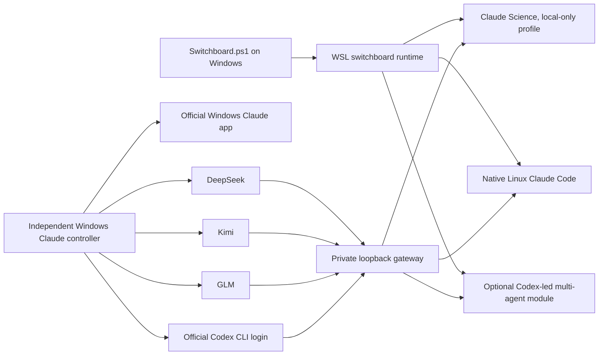

# Claude Codex Switchboard

**One Windows entry point for Claude Science, Claude Code, the official Windows Claude app, and an optional Codex-led multi-agent workspace.**

[简体中文](README.zh-CN.md) · [Operations guide](operation.md) · [Code walkthrough](docs/CODE_WALKTHROUGH.zh-CN.md) · [Project research and adoption report](docs/PROJECT_RESEARCH_REPORT.zh-CN.md)

Version **3.3.0** routes four independently owned backends:

| Backend | Credential owner | Available surfaces |
| --- | --- | --- |
| DeepSeek API | Per-user WSL secret or Windows DPAPI profile | WSL Claude Science, WSL Claude Code, Windows Claude, optional Claude workers |
| Kimi API | Per-user WSL secret or Windows DPAPI profile | WSL Claude Science, WSL Claude Code, Windows Claude, optional Claude workers |
| GLM API | Per-user WSL secret or Windows DPAPI profile | WSL Claude Science, WSL Claude Code, Windows Claude, optional Claude workers |
| ChatGPT / Codex login | Official Codex CLI `auth.json` | WSL Claude Science, WSL Claude Code, Windows Claude, optional Claude workers |

The WSL and Windows application stacks are intentionally separate. Windows Claude never calls WSL. WSL Claude Science uses a local-only workbench identity and does not require a Claude.ai account; upstream inference still requires one configured API key or an official Codex ChatGPT login.

## Architecture



Every provider has independent **Opus**, **Sonnet**, and **Haiku** model routes and independent **Reasoning** values. A Sonnet route is no longer coupled to Opus. Kimi and GLM choices are model-family specific (including K3/K2.6/K2.7 and GLM 4.7/5.2/5.3), so unsupported wire combinations fail before upstream I/O. When available, the local Codex cache supplies its most recently advertised models and reasoning levels for configuration-time validation; the cache is not a live entitlement or request-acceptance guarantee.

## Quick start

Requirements:

- Windows 10 2004+ or Windows 11;
- WSL2 with Ubuntu 24.04, installed automatically when permitted;
- a normal Windows user account;
- **Windows Python 3.10+ only when using the independent Windows Claude app gateway**; `Build.cmd` installs WSL Python, not a Windows Python runtime;
- at least one provider API key or an official Codex CLI ChatGPT login.

Clone or download the repository, then run:

```powershell
git clone https://github.com/Tsaer-maker/claude-codex-switchboard.git
Set-Location .\claude-codex-switchboard
.\Build.cmd
.\Switchboard.cmd
```

From the menu:

1. configure one or more backends;
2. adjust the three model/reasoning routes if desired;
3. start WSL Claude Science, native WSL Claude Code, or the independent Windows Claude stack;
4. optionally install the WSL multi-agent module.

Common non-interactive commands:

```powershell
# Configure and start WSL Claude Science
.\windows\Switchboard.ps1 -Action configure-deepseek
.\windows\Switchboard.ps1 -Action deepseek

# Inspect or update independent model/reasoning routes
.\windows\Switchboard.ps1 -Action models
.\windows\Switchboard.ps1 -Action update-models

# Configure the independent Windows Claude stack; this never invokes WSL
.\windows\Switchboard.ps1 -Action windows-claude-init
.\windows\Switchboard.ps1 -Action windows-claude-configure -RemainingArgs codex
.\windows\Switchboard.ps1 -Action windows-claude -RemainingArgs codex

# Optional one-time copy of the official Windows Codex login into WSL
.\windows\Switchboard.ps1 -Action migrate-windows-codex-auth-to-wsl
```

The one-time import copies only the selected official Codex login. One WSL lock owns snapshot, stop, staged validation, atomic replacement, and exact restoration of the prior WSL runtime shape (stopped, gateway-only, or Science with its current provider). It does not create ongoing synchronization: the Windows and WSL Codex CLIs remain independently login-capable afterward.

Runtime-only updates roll back package-managed code, the exact connector owner, wrappers, and release metadata on failure. Auth, model routes, and their latest derived config are deliberately outside installer rollback, so an older snapshot cannot overwrite a newer official Codex CLI refresh or another terminal's committed route.

## Optional multi-agent module

The optional WSL module keeps Codex as the controlling session and gives it access to persistent, provider-routed Claude workers. It installs the MIT-licensed `coredo-eu/codex-claude-orchestrator` at an exact reviewed commit in Switchboard's isolated WSL Codex home.

```powershell
.\windows\Switchboard.ps1 -Action agents-install
.\windows\Switchboard.ps1 -Action agents-status
.\windows\Switchboard.ps1 -Action agents -Project D:\work\my-repo -RemainingArgs deepseek
.\windows\Switchboard.ps1 -Action agents-off
.\windows\Switchboard.ps1 -Action agents-stop
```

The upstream plugin implementation remains intact inside Codex: persistent PTY workers, role/model routing, leases, private runtime snapshots, compaction checkpoints, bounded edit custody, native Codex fallback roles, and a kill switch. Switchboard adds provider routing, isolated credential ownership, a pinned checkout, dependency checks, and Windows menu entry points. `Reasoning=auto` preserves a supported effort requested by an upstream role and otherwise leaves the model default; API-provider capabilities are enforced per model, while Codex also enforces the local cache declaration when one exists and marks a missing declaration as unknown. Unsupported known combinations fail closed instead of being silently downgraded. An explicit tier value intentionally overrides every upstream role in that tier. Installing or toggling this module does not modify Windows Claude, Claude Science credentials, or provider secrets.

This is **environment/auth separation, not a filesystem sandbox**. Workers inherit Codex/Claude tool approvals and run as the same WSL user: they can access the selected project and any Windows mounts visible to that user, including `/mnt/<drive>`. Do not place unrelated secrets in the working tree; use the normal Codex/Claude approval and sandbox controls for file or command access. “Windows auth not injected” means the controller does not copy Windows credentials into worker environments—it does not mean Windows files are technically unreachable.

Launching the multi-agent Codex entry is fail-closed: it first requires `MULTI_AGENT_READY=true`, so a missing or disabled plugin cannot silently open an ordinary Codex session under a misleading multi-agent label. If Claude Science is already running, the worker provider must match its healthy active gateway; choosing a different provider requires an explicit Science switch or stop.

After installation, start a **new Codex task** so the bundled skill is discovered, then opt in explicitly:

```text
Use $codex-claude-orchestrator:claude-pty-agents for this bounded outcome.
Keep Codex as the authority owner and independently verify Claude's handoff.
```

Plugin installation exposes the transport; a plain prompt does not guarantee delegation. Switchboard deliberately does not auto-edit a project's `AGENTS.md` or install an executor-selection policy.

## Security and compatibility boundaries

- Gateways bind to loopback and use random private paths/control tokens.
- Provider secrets stay with their owning WSL user or Windows DPAPI profile.
- The official Codex CLI is the only writer/refresh owner for its `auth.json`. Switchboard gateways read it, adopt a newer CLI-written access token after a 401, and otherwise fail closed with a re-login/refresh instruction; credentials are never converted into a general-purpose API key.
- Unknown Claude Science or connector state fails closed instead of being overwritten.
- Runtime updates are transactional and restore the previous managed files on failure.
- `%LOCALAPPDATA%\ScienceCodexFinalKit`, `~/.local/share/science-codex-finalkit`, `~/.science-finalkit`, `~/.finalkit-client`, `FINALKIT_*`, and `fkctl` remain as legacy-compatible internal namespaces so an upgrade does not move credentials or invalidate existing installations.
- The package does not bypass logins, subscriptions, quotas, provider policy, captcha, or billing.

Switchboard's original code and documentation are released under the [MIT License](LICENSE). Third-party components retain their own licenses and notices in [THIRD_PARTY_NOTICES.md](THIRD_PARTY_NOTICES.md).

## Documentation

- [Chinese product page and complete feature matrix](README.zh-CN.md)
- [Installation, configuration, recovery, and command guide](operation.md)
- [Runtime ownership and code architecture](docs/CODE_WALKTHROUGH.zh-CN.md)
- [External-project search, comparison, adoption, and rejection report](docs/PROJECT_RESEARCH_REPORT.zh-CN.md)
- [Third-party notices](THIRD_PARTY_NOTICES.md)
