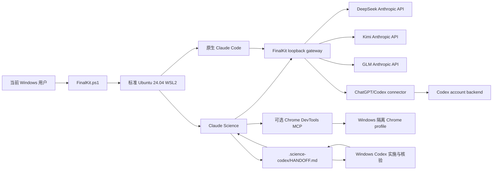

# Science SwitchModel / FinalKit 3.1.1

这是一个面向普通 Windows 用户的可重建科研 Agent 环境：在标准 Ubuntu 24.04 WSL2 内安装 Claude Science、原生 Linux Claude Code、Linux Codex CLI，以及 DeepSeek、Kimi、GLM、ChatGPT/Codex 四种后端；Windows 侧继续使用已登录的 Codex，并可通过一份项目交接文件和一个显式启用的隔离浏览器桥与 WSL 协作。

> 从零安装、新用户最短路径、日常启停、故障恢复和多用户操作统一见 [operation.md](operation.md)。

FinalKit 不依赖 Docker，不复制 HGSX 的专有代码、镜像、验证码或用户系统，也不尝试绕过任何授权。它吸收的是可独立实现的通用思想：单入口切换、后端健康检查、进程身份验证、失败回滚、每用户隔离和可读诊断。对当前目标而言，WSL 原生安装比几 GB Docker 镜像更轻、启动路径更短、文件权限和浏览器互通也更清楚。

## 1. Clear：删除旧 Ubuntu WSL（可选）

如果本机 WSL 已经混乱，先双击根目录的 `Clear.cmd`。它只处理当前 Windows 用户注册的、名称明确匹配的 Ubuntu；删除前会显示发行版名称和注册表 BasePath，要求输入完整确认，并默认导出可恢复 tar。

PowerShell 用法：

```powershell
# 默认只清理标准 Ubuntu-24.04
.\windows\FinalKit.ps1 -Action clear

# 逐个核验并清理当前 Windows 用户的所有 Ubuntu 发行版
.\windows\FinalKit.ps1 -Action clear -AllUbuntu

# 自动化测试：免交互，但仍默认备份
.\windows\FinalKit.ps1 -Action clear -AllUbuntu -Force

# 真正不留备份；仅在已确认没有独有数据时使用
.\windows\FinalKit.ps1 -Action clear -AllUbuntu -Force -NoBackup
```

Clear 的边界：

- 不执行全局 `wsl --shutdown`；
- 不用通配符删除目录；
- 不碰 Docker Desktop 发行版；
- 不碰其他 Windows 用户的 WSL 注册；
- 先验证名称、BasePath 和 Ubuntu 身份，再对精确名称执行 `wsl --unregister`；
- 备份默认位于 `%LOCALAPPDATA%\ScienceCodexFinalKit\Backups`。

`wsl --unregister` 会永久删除该发行版 VHDX 内的数据。需要保留的项目应先复制到 Windows、HPC 或其他权威位置。

## 2. Build：建立 WSL、Claude Science、Claude 与依赖

双击根目录的 `Build.cmd` 或 `Install.cmd`。默认建立标准 `Ubuntu-24.04`，使用 Windows 当前用户的正常 WSL 存储位置，不再强制 `TSA-*` 专用名称。

全新 Windows 机器尚未启用 WSL 平台时，Build 会只为 `wsl.exe --install --no-distribution` 请求一次 UAC 管理员批准。这个提升进程只准备 Windows 的 WSL/Virtual Machine Platform，不安装 Ubuntu，也不写 FinalKit 凭证。若 Windows 要求重启，Build 会明确停止；重启并登录回同一个普通 Windows 用户后再次运行 Build，Ubuntu 才注册到该用户。不要从另一个 Administrator 账号安装发行版。

普通 Store 路径下载 Ubuntu 失败时，Build 会保留完整可读诊断，并按微软支持的方式自动重试 `--web-download`。它能自适应解码不同 WSL 版本产生的 UTF-16LE、UTF-8，以及错误路径中两者混合的本地化输出。

```powershell
.\windows\FinalKit.ps1 -Action build
```

Build 完成四件事：

1. 安装或复用标准 Ubuntu 24.04 WSL2；
2. 安装 `bubblewrap`、`socat`、Python、Git、curl、jq、rsync、xz 等系统依赖；
3. 在当前 Linux 用户 home 安装官方 Claude Science、官方原生 Linux Claude Code、官方 Linux Codex CLI、固定版本的 Node.js LTS 和 Chrome DevTools MCP；
4. 安装 FinalKit 切换器与固定提交的 ChatGPT/Codex connector，执行不读凭据、不联网的 connector、Science control、model-route、runtime-update rollback 四组 contract，再执行 `doctor` 和不调用外部模型的 `smoke`。

默认 Linux 用户名由 Windows 用户名安全转换得到，也可以显式指定：

```powershell
.\windows\FinalKit.ps1 -Action build -LinuxUser alice
```

如确实需要自定义发行版名，必须同时提供精确安装位置：

```powershell
.\windows\FinalKit.ps1 -Action build `
  -Distro Research-Ubuntu-24.04 `
  -DistroLocation D:\WSL\Research-Ubuntu-24.04 `
  -LinuxUser alice
```

Build 可重复运行用于修复。它不会建立 passwordless sudo，不修改 `.wslconfig`、Windows 代理或默认浏览器，不复制其他用户的登录状态。

3.0.1–3.0.3 依次修复无发行版、本地化 WSL 输出以及首次安装需要提升时的 Build 中断。3.0.4 将 ChatGPT/Codex 默认授权改为官方浏览器 OAuth，并让官方 WSL Codex 缓存成为 connector 唯一凭据 owner。3.0.5 增加 `Windows Codex 实施 -> Claude Science 独立审阅 -> Windows Codex 核验/修复` 闭环和标准审阅 skill。3.0.6 校准本地 Science skill 发布面，同时修正 Codex 三档路由。3.0.7 去掉精确发行号门禁，按命令 capability 兼容旧 runtime，并让 Codex `/v1/models` 透明显示真实三档模型。3.1.0 将升级拆成 FinalKit runtime、厂商模型路由和官方工具三个独立入口；3.1.1 又为 DeepSeek/Kimi/GLM 增加按当前账号读取官方可调用模型目录、编号选择和确认式更新。模型路由成为每个 Linux 用户持久拥有、原子写入、可预览且不会被以后软件包默认值覆盖的配置。发行号只用于识别分发包和诊断，不是运行门禁；beta device code 仅保留为显式备用。

### 多用户模型

FinalKit 的隔离单位是“Windows 用户 + WSL 发行版 + Linux 用户”：

| 层 | 归属 | 隔离内容 |
|---|---|---|
| Windows 用户 | 当前登录的 Windows 账号 | WSL 注册、FinalKit 浏览器 profile、Windows Codex 登录 |
| WSL 发行版 | 当前 Windows 用户的 Ubuntu | 系统包、Linux 文件系统 |
| Linux 用户 | 每个 `/home/<user>` | API key、Claude Science 数据、Claude/Codex 登录、运行锁、日志 |

在同一 Ubuntu 内为另一个 Linux 用户再次运行 Build 即可；每位用户必须独立配置自己的 provider key 和账号登录。凭证不会放入共享包目录。

## 3. 配置 provider

所有 API key 都通过终端隐藏输入写入当前 Linux 用户的 WSL ext4 home，权限为 `0600`。不要把 key 写进 `.cmd`、PowerShell 历史、项目配置或 `HANDOFF.md`。

```powershell
.\windows\FinalKit.ps1 -Action configure-deepseek
.\windows\FinalKit.ps1 -Action configure-kimi
.\windows\FinalKit.ps1 -Action configure-glm
.\windows\FinalKit.ps1 -Action configure-codex
```

也可以双击 `windows` 目录内对应的配置脚本。

| 模式 | 官方 Anthropic 兼容入口 | Opus / 默认 | Sonnet | Haiku / 快速 | 认证方式 |
|---|---|---|---|---|---|
| DeepSeek | `https://api.deepseek.com/anthropic` | `deepseek-v4-pro` | `deepseek-v4-pro` | `deepseek-v4-flash` | `x-api-key` |
| Kimi | `https://api.moonshot.ai/anthropic` | `kimi-k3[1m]` | `kimi-k3[1m]` | `kimi-k2.6` | Bearer |
| GLM | `https://open.bigmodel.cn/api/anthropic` | `glm-5.2` | `glm-5.2` | `glm-4.7-flash` | `x-api-key` |
| ChatGPT/Codex | 独立 Codex account connector | `gpt-5.6-sol` + `max` | `gpt-5.6-terra` + `max` | `gpt-5.6-luna` + `max` | 官方 WSL Codex 浏览器 OAuth；device code 为备用 |

首次安装仍可从 WSL 环境变量导入模型，例如 `FINALKIT_KIMI_MODEL`、`FINALKIT_GLM_FAST_MODEL`；Codex 三档为 `FINALKIT_CODEX_OPUS_MODEL`、`FINALKIT_CODEX_SONNET_MODEL`、`FINALKIT_CODEX_HAIKU_MODEL`，公共推理强度为 `FINALKIT_CODEX_REASONING_EFFORT`（允许 `none/low/medium/high/xhigh/max`）。导入后，唯一 owner 是当前 Linux 用户的 `~/.local/share/science-codex-finalkit/config/model-routes.json`。以后厂商换代不再 Build：菜单 `17 Update provider models` 可先按已配置账号只读拉取 DeepSeek/Kimi/GLM 的官方可调用目录，再用编号或手写 ID 选择 main/fast，dry-run 预览后才原子更新；Codex 三档仍在同一入口手工选择。若厂商只升级同一 alias 背后的权重（如 `deepseek-v4-pro` 继续指向 Pro-0813），目录会显示当前 ID 仍有效，无需改路由。软件包更新只补新增 provider 的默认字段，不覆盖已有选择。目录和推理上游 URL 都是包内固定 HTTPS 白名单，避免把 key 转发到任意地址。

Claude Science 要求请求 ID 保留 `claude-opus` / `claude-sonnet` / `claude-haiku` 兼容家族，但菜单标题来自 gateway 的 `/v1/models` `display_name`。FinalKit 因此保留兼容 ID，同时把标题明确显示为 `ChatGPT Codex | gpt-5.6-sol | max`、`...terra...`、`...luna...`；这与 DeepSeek/Kimi/GLM 的透明显示机制一致，不修改 Claude Science 前端。Science 仍可能在标题下显示 `Best for scientific rigor` 等固定家族说明，那只是兼容档位的前端描述。显示名便于识别，最终身份仍以启动、`status`、`doctor` 输出的 `EFFECTIVE_ROUTE` 和 gateway 日志中的 `model=... | effort=... | original_model=...` 为准。

### 三类独立更新

以后不需要为每次模型换代重新 Build：

- 菜单 `16` / `-Action update-runtime`：只更新 FinalKit manager、gateway 和受控 connector patch，可离线使用当前包；
- 菜单 `17` / `-Action update-models`：只读发现 DeepSeek/Kimi/GLM 当前账号的官方可调用目录，编号/手工选择后预览并持久更新 main/fast；Codex 三档与 effort 手工更新；
- 菜单 `18` / `-Action update-tools`：明确联网更新官方 Claude Science、Claude Code、Codex CLI 和本包固定的 Node/MCP。

三条路径都不重建 Ubuntu。runtime 更新有精确文件回滚，模型更新有 dry-run、原子写入和当前 backend 的显式重启/失败恢复，tools 更新会验证既有 Codex auth 文件未被安装流程改变。完整命令、恢复边界和示例见 [operation.md](operation.md#三类-update以后换模型不再-build)。

## 4. SwitchModel：启动和切换

最简单的入口是双击根目录 `SwitchModel.cmd`。命令行用法：

```powershell
.\windows\FinalKit.ps1 -Action deepseek
.\windows\FinalKit.ps1 -Action kimi
.\windows\FinalKit.ps1 -Action glm
.\windows\FinalKit.ps1 -Action codex
.\windows\FinalKit.ps1 -Action status
.\windows\FinalKit.ps1 -Action doctor
.\windows\FinalKit.ps1 -Action stop
```

启动后 FinalKit 在 WSL loopback 上建立一个经过身份验证的本地 gateway，再让 Claude Science 只连接该 endpoint。切换过程是一个事务：停止 Science、停止已验证 owner 的旧 gateway、启动并核验新 gateway、启动 Science、核对 Science 的实际环境，最后才提交当前模式；失败则恢复切换前的已观察状态。

原生 Linux Claude Code 也可以使用同一套 provider：

```powershell
.\windows\FinalKit.ps1 -Action claude -RemainingArgs deepseek
.\windows\FinalKit.ps1 -Action claude -RemainingArgs kimi,--help
```

或在 WSL 内直接运行：

```bash
fkctl claude deepseek
fkctl claude glm --help
```

该命令临时注入本地 endpoint，不把真实 API key交给 Claude Code 进程。Claude Code 与 Claude Science 使用同一个已选 gateway，但各自仍是独立客户端。

## 5. Windows 浏览器桥

浏览器能力分三层，不能混为一谈：

1. Windows 默认浏览器打开 Claude Science 的本地 Web UI；
2. Claude Science 内部的 WebSearch/WebFetch，仍受 Science sandbox 和权限卡控制；
3. 可选 Chrome DevTools MCP，用于需要真实页面、登录态、点击、表单或截图的任务。

第三层必须显式启动：

```powershell
.\windows\FinalKit.ps1 -Action browser-start
.\windows\FinalKit.ps1 -Action browser-science
.\windows\FinalKit.ps1 -Action browser-status
.\windows\FinalKit.ps1 -Action browser-mcp-info
```

`SwitchModel.cmd` 菜单的 `7–10` 才负责选择后端并启动/打开 Claude Science；`11` 只把当前 Science URL 打开到隔离自动化 Chrome，方便 MCP 控制同一窗口。`12 Status`、`13 Doctor` 都是只读检查，不能代替启动；`14` 只停 Science/gateway，`15` 只停自动化 Chrome；`16/17/18` 分别更新 runtime、模型路由和官方工具。

FinalKit 启动 Windows Chrome 时固定使用：

- `127.0.0.1:9223`；
- `%LOCALAPPDATA%\ScienceCodexFinalKit\ChromeProfile` 独立 profile；
- `--remote-debugging-address=127.0.0.1`；
- 非默认 `--user-data-dir`。

Chrome 136 以后，远程调试要求使用非默认 profile；FinalKit 不读取或接管日常 Chrome profile。隔离 profile 中打开的所有标签页都可能被 MCP 检查和控制，因此只登录你明确允许自动化访问的网站。

`browser-mcp-info` 会打印 Claude Science 自定义 MCP 所需的精确命令。进入 Claude Science：

```text
Customize -> Connectors -> Custom MCP -> stdio
```

命令通常是：

```text
/home/<user>/.local/bin/chrome-devtools-mcp-finalkit
```

参数：

```text
--browser-url=http://127.0.0.1:9223 --slim
```

Claude Code 也可显式登记同一 MCP；FinalKit 不自动写入其配置：

```bash
claude mcp add chrome-devtools -- \
  ~/.local/bin/chrome-devtools-mcp-finalkit \
  --browser-url=http://127.0.0.1:9223 --slim
```

停止桥：

```powershell
.\windows\FinalKit.ps1 -Action browser-stop
```

停止只终止命令行中包含精确隔离 profile 的 Chrome 进程，保留 profile 数据。若 WSL 不能访问 Windows 的 `127.0.0.1`，需由用户检查 WSL mirrored networking；FinalKit 不静默修改 `.wslconfig`。

## 6. Claude Science 与 Windows Codex 协作

FinalKit 不让两个 Agent 同时无边界写同一项目，也不共享 OAuth token。默认采用非对称审阅模式：Windows Codex 负责实施和直接验证，Claude Science 负责独立、只读地挑战方法、身份、代码、Source Data、图表、报告和 claim，Windows Codex 再逐项核验发现并修复最早受影响的 owner。

跨运行时事实 owner 仍只有项目内这一份：

```text
.science-codex/HANDOFF.md
```

初始化：

```powershell
.\windows\FinalKit.ps1 -Action init-project -Project D:\path\to\project
```

在本地 Claude Science 工作台中进行一次个人 skill 发布。由你在当前 Windows 浏览器对话里明确要求 Claude Science 使用内置 `customize` skill，通过 `host.skills.edit` 写入、`host.skills.publish` 发布，并用 `host.skills.list` / `host.skills.read` 回读确认。源文件是：

```text
claude-science-skills\reviewing-codex-science\SKILL.md
```

若当前 Claude Science 沙箱不能直接读取 `/mnt/d/Tools/ScienceCodexFinalKit/.../SKILL.md`，就在浏览器把该 `SKILL.md` 作为附件交给它。`reviewing-codex-science.zip` 是同一源的便携备份，只用于确实暴露标准自定义 Skills 上传界面的 Claude 产品；不能据此假定本地 Claude Science 已安装。FinalKit 不直接写 Claude Science 的 skill 数据库、会话、cookie 或账号状态。

默认节奏：

1. Windows Codex 完成一段可独立审阅的实现和直接验证，并在 `HANDOFF.md` 冻结精确 owner、结果、Source Data、图表、报告和日志；
2. Claude Science 使用 `reviewing-codex-science`，从权威输入和真实项目证据独立重建结论；科学项目文件保持只读，若用户要求写回，只替换 handoff 中标记的 Claude Science 审阅区；
3. Windows Codex 对每个 `critical`、`major` 和决策相关 `uncertain` 发现标记 `accepted / rejected / unresolved`，给出决定性证据，修复后直接复验；
4. 只有方法、estimand、身份、canonical result、exact Source Data、出版图或 claim boundary 发生变化时才再开下一轮审阅；
5. 每一阶段只有一个 writer。用户日常 Windows 浏览器仍由用户控制。

Claude Science 是审阅工作台，不代表固定模型。handoff 必须记录其当轮实际 provider/model 与独立性边界：不同 provider/model family 可标记 `different_model_provider`；若 Science 使用 Codex backend，只能标记 `separate_context_only`；无法核实时标记 `unknown`。独立会话仍能发现上下文、工具链和复核路径问题，但不能冒充跨模型一致性。

反向流程仍受支持：Claude Science/Claude Code 确实拥有执行时，可更新同一 handoff，再让 Windows Codex 只读复核：

```powershell
.\windows\FinalKit.ps1 -Action windows-review -Project D:\path\to\project
```

Windows Codex CLI 的 `windows-review` 固定为 ephemeral + read-only，不负责浏览器登录。Codex Desktop 的浏览器/Computer Use 是另一条显式授权面；两者通过同一 `HANDOFF.md` 对齐事实，而不是共享 cookie 或后台数据库。

## 7. 架构与数据流



关键目录均为每 Linux 用户私有：

```text
~/.local/share/science-codex-finalkit/
  runtime/                 # gateway 与 switch manager owner
  bridge/                  # 固定提交的 Codex connector + venv
  browser-mcp/             # 固定版本 Chrome DevTools MCP
  node-v24.19.0/           # 校验 SHA256 后安装的 Node.js LTS
  node-current -> ...      # MCP 包装入口使用的受控版本指针
  secrets/                 # 0600 provider key 和本地控制 token
  run/                     # PID/start ticks/current mode/lock
  logs/                    # gateway 与 Science 启动日志

~/.science-finalkit/
  .claude-science/         # 隔离的 Science 数据、加密键与会话
```

## 8. 为什么不使用 Docker

HGSX 的离线 Docker 可能适合供应商封装、固定大环境或受控演示，但 FinalKit 的主要需求是：普通用户重建、WSL/Windows 路径互通、Claude 官方客户端更新、按用户保存凭证、Windows 浏览器协作和透明故障诊断。Docker 会增加镜像体积、daemon、卷映射、端口层和用户映射，却不能解决过期验证码或专有授权。

因此 v3 选择：

- Ubuntu 24.04 WSL2 作为唯一 Linux 运行面；
- 官方 installer 安装 Claude Science/Claude Code/Codex；
- 只有 ChatGPT/Codex 使用需要协议翻译的 connector；
- DeepSeek/Kimi/GLM 走极窄的原生 Anthropic pass-through；
- 不导入 HGSX Docker 中无法证明许可证和更新边界的内容。

如果以后确有一个科学工具只能在容器中可靠复现，可把它作为项目级计算依赖加入，而不是把整个 Agent 控制面塞入 Docker。

## 9. 验证与诊断

不产生外部模型费用：

```powershell
.\windows\FinalKit.ps1 -Action doctor
.\windows\FinalKit.ps1 -Action smoke
```

`smoke` 会依次启动 DeepSeek/Kimi/GLM 本地离线 gateway，验证 provider 身份、私密 path、PID/start ticks 和 Claude Science endpoint；占位 key 只存在匿名 pipe 中，不落盘，也不连接供应商。

Build 还会调用 `wsl/tests/connector_contract.py`，在临时配置中替换认证与 HTTP client，逐档捕获 connector 最终准备发送的 Responses payload。只有模型目录恰好为三条、Opus/Sonnet/Haiku 分别成为 Sol/Terra/Luna 且 `reasoning.effort=max` 才通过；`wsl/tests/runtime_control_contract.py` 另行覆盖 Science 正常停止、健康 owner、失联 control socket、PID/lock 冲突和“不得发送信号”的失败路径；`wsl/tests/model_routes_contract.py` 覆盖旧错误默认值迁移、dry-run、原子持久化、非法 ID 和未来 provider 保留；`wsl/tests/installer_update_contract.sh` 用临时 fixture 覆盖 runtime 更新失败的精确文件回滚与成功提交。四者都不读取真实 auth、不连接网络，也不产生账号用量。

真实后端最小请求：

```powershell
.\windows\FinalKit.ps1 -Action test-deepseek
.\windows\FinalKit.ps1 -Action test-kimi
.\windows\FinalKit.ps1 -Action test-glm
.\windows\FinalKit.ps1 -Action test-codex
```

真实测试会发送“只返回 `BACKEND_OK`”的小请求，可能产生少量费用。若失败，查看：

```bash
fkctl logs gateway
fkctl logs science
fkctl status
fkctl doctor
```

日志不会主动打印 API key。若把 key 粘贴进聊天、命令行或截图，应在供应商控制台轮换。

## 10. 安全边界

- API key 只存当前 Linux 用户 home，权限 `0600`；
- key、instance id、gateway secret 和 connector control token通过继承 FD 传递，不出现在 argv；
- direct gateway 仅 bind `127.0.0.1`，入口包含随机私密 path；
- provider URL 是源码固定白名单，且不跟随 redirect；
- manager 停进程前核对 PID、Linux start ticks 和 owner 脚本路径；
- Science 的假本地 OAuth 只用于接受本机 BYOK gateway，不产生 Anthropic 订阅或服务端权限；
- ChatGPT/Codex 由隔离 HOME 内的官方 Linux Codex CLI 登录缓存唯一持有；connector 读写同一缓存，不复制 Windows Codex refresh token，也不再维护第二份 refresh chain；意外 `401` 仅在共享缓存确实刷新后重试一次；
- 浏览器桥只使用独立 Chrome profile；
- `HANDOFF.md` 只传事实和文件路径，不传账号秘密；
- FinalKit 不绕过验证码、许可证、用户上限、付费边界或供应商授权。

## 11. 文件入口

| 文件 | 用途 |
|---|---|
| `Clear.cmd` | 精确清理选定 Ubuntu，默认备份 |
| `Build.cmd` / `Install.cmd` | 建立或修复标准 WSL 栈 |
| `SwitchModel.cmd` | 普通用户菜单 |
| `operation.md` | 从零安装、日常运行、协作、故障和恢复操作手册 |
| `windows/FinalKit.ps1` | Windows owner：Clear/Build/启动/浏览器/协作 |
| `wsl/install-final-stack.sh` | WSL 安装 owner |
| `wsl/runtime/switch_manager.py` | 事务切换、身份、回滚、doctor/smoke/test |
| `wsl/runtime/direct_gateway.py` | DeepSeek/Kimi/GLM 固定白名单直通 |
| `wsl/tests/connector_contract.py` | 无凭据、无网络验证 Codex 三档目录与最终请求 payload |
| `wsl/tests/model_routes_contract.py` | 无凭据、无网络验证旧配置迁移、dry-run、持久保留与未来 provider 合并 |
| `wsl/tests/runtime_control_contract.py` | 无凭据、无进程信号验证 Science owner 与失联控制面 |
| `wsl/tests/installer_update_contract.sh` | 临时 fixture 验证 runtime 更新失败精确回滚、成功提交 |
| `wsl/chrome-devtools-mcp-finalkit` | 固定 Node 绝对路径的 MCP 薄入口 |
| `wsl/connector-security.patch` | Codex connector 的窄安全补丁 |
| `project-template/HANDOFF.md` | Science/Claude/Codex/浏览器单一交接面 |
| `claude-science-skills/reviewing-codex-science/SKILL.md` | Claude Science 独立审阅 skill 的可读源 owner |
| `claude-science-skills/reviewing-codex-science.zip` | 与可读源一致的便携 Agent Skill 包；仅用于支持标准 ZIP 上传的 Claude surface |
| `docs/CODE_WALKTHROUGH.zh-CN.md` | 维护者代码剖析 |

## 12. 官方依据

- Claude Code 原生安装与 WSL 支持：[Claude Code getting started](https://code.claude.com/docs/en/getting-started)
- DeepSeek Anthropic API、模型与只读账号目录：[Quick Start](https://api-docs.deepseek.com/)、[List Models](https://api-docs.deepseek.com/api/list-models)
- Kimi Anthropic API：[Kimi API overview](https://platform.kimi.ai/docs/api/overview) 与 [Claude Code with Kimi](https://platform.kimi.ai/docs/guide/claude-code-kimi)
- GLM Anthropic 兼容入口：[智谱 Claude/Anthropic API 指南](https://docs.bigmodel.cn/cn/guide/develop/claude/introduction)
- OpenAI Sol/Terra/Luna 定位、模型 ID 与支持的推理强度：[OpenAI model catalog](https://developers.openai.com/api/docs/models)
- OpenAI 对 `reasoning.effort` 的选择建议：[Using GPT-5.6](https://developers.openai.com/api/docs/guides/latest-model)
- Node.js 固定版本与校验文件：[Node.js distributions](https://nodejs.org/dist/)
- Chrome 独立调试 profile 要求：[Chrome remote debugging changes](https://developer.chrome.com/blog/remote-debugging-port)
- Chrome DevTools MCP 参数与风险：[ChromeDevTools/chrome-devtools-mcp](https://github.com/ChromeDevTools/chrome-devtools-mcp)
- Claude.ai 标准自定义 Skills 包的创建、上传与启用（仅说明便携 ZIP 兼容面，不代替本地 Claude Science 的 `host.skills` 发布）：[Use skills in Claude](https://support.claude.com/en/articles/12512180-use-skills-in-claude) 与 [How to create custom skills](https://support.claude.com/en/articles/12512198-how-to-create-custom-skills)

第三方代码、版本和许可证见 `THIRD_PARTY_NOTICES.md`。
