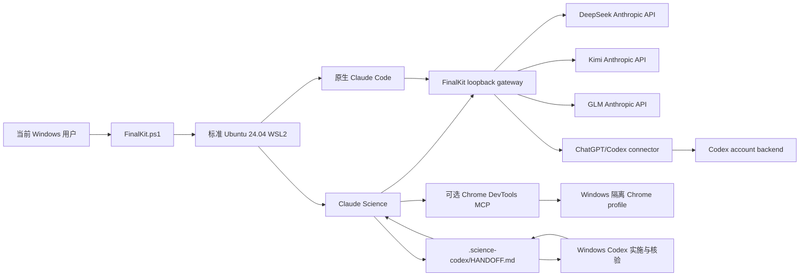

# Science SwitchModel / FinalKit 3.2.3

这是一个面向普通 Windows 用户的可重建科研 Agent 环境：在标准 Ubuntu 24.04 WSL2 内安装 Claude Science、原生 Linux Claude Code、Linux Codex CLI，以及 DeepSeek、Kimi、GLM、ChatGPT/Codex 四种后端；Windows 侧继续使用已登录的 Codex，并可通过一份项目交接文件和一个显式启用的隔离浏览器桥与 WSL 协作。官方 Windows Claude 应用另有一套完全独立的四 provider profile：DeepSeek/Kimi/GLM 使用 Windows DPAPI API key，Codex 复用 Windows Codex CLI 的官方 ChatGPT 登录；它们只使用 Windows 本机状态、Python 和 `127.0.0.1:18987`，不调用、不读取也不切换 WSL。

> 从零安装、新用户最短路径、日常启停、故障恢复和多用户操作统一见 [operation.md](operation.md)。

FinalKit 不依赖 Docker，不复制 HGSX 的专有代码、镜像、验证码或用户系统，也不尝试绕过任何授权。它吸收的是可独立实现的通用思想：单入口切换、后端健康检查、进程身份验证、失败回滚、每用户隔离和可读诊断。对当前目标而言，WSL 原生安装比几 GB Docker 镜像更轻、启动路径更短、文件权限和浏览器互通也更清楚。

当前机器上的默认边界是：WSL Claude Science 继续采用无 Claude.ai 账号的 API-only 本地身份，Science 端口 `8765`、WSL gateway 端口 `9876`；Windows Claude 使用单独的 Windows-only profile，Windows Codex 槽复用本机官方 ChatGPT 登录并把 Opus、Sonnet、Haiku 分别路由到 Sol、Terra、Luna，每档只配置自己的 Model/Reasoning，DeepSeek/Kimi/GLM 则等待各自 API 配置。登记或配置槽位不会改动 WSL。Windows 与 WSL 两套配置、进程、端口和启停命令保持独立；Codex 登录默认也独立，只有用户显式运行一次性迁移入口时才把当时的 Windows 官方 auth 原子导入目标 WSL，之后不再同步。

## 1. Clear：删除旧 Ubuntu WSL（可选）

如果本机 WSL 已经混乱，先双击根目录的 `Clear.cmd`。它只处理当前 Windows 用户注册的、名称明确匹配的 Ubuntu；删除前会显示发行版名称和注册表 BasePath，要求输入完整确认，并默认导出可恢复 tar。

PowerShell 用法：

```powershell
# 默认只清理标准 Ubuntu-24.04
.\windows\FinalKit.ps1 -Action clear

# 逐个核验并清理当前 Windows 用户的所有 Ubuntu 发行版
.\windows\FinalKit.ps1 -Action clear -AllUbuntu

# 自动化测试：免交互，但仍默认备份
.\windows\FinalKit.ps1 -Action clear -AllUbuntu -Force

# 真正不留备份；仅在已确认没有独有数据时使用
.\windows\FinalKit.ps1 -Action clear -AllUbuntu -Force -NoBackup
```

Clear 的边界：

- 不执行全局 `wsl --shutdown`；
- 不用通配符删除目录；
- 不碰 Docker Desktop 发行版；
- 不碰其他 Windows 用户的 WSL 注册；
- 先验证名称、BasePath 和 Ubuntu 身份，再对精确名称执行 `wsl --unregister`；
- 备份默认位于 `%LOCALAPPDATA%\ScienceCodexFinalKit\Backups`。

`wsl --unregister` 会永久删除该发行版 VHDX 内的数据。需要保留的项目应先复制到 Windows、HPC 或其他权威位置。

## 2. Build：建立 WSL、Claude Science、Claude 与依赖

双击根目录的 `Build.cmd` 或 `Install.cmd`。默认建立标准 `Ubuntu-24.04`，使用 Windows 当前用户的正常 WSL 存储位置，不再强制 `TSA-*` 专用名称。

全新 Windows 机器尚未启用 WSL 平台时，Build 会只为 `wsl.exe --install --no-distribution` 请求一次 UAC 管理员批准。这个提升进程只准备 Windows 的 WSL/Virtual Machine Platform，不安装 Ubuntu，也不写 FinalKit 凭证。若 Windows 要求重启，Build 会明确停止；重启并登录回同一个普通 Windows 用户后再次运行 Build，Ubuntu 才注册到该用户。不要从另一个 Administrator 账号安装发行版。

普通 Store 路径下载 Ubuntu 失败时，Build 会保留完整可读诊断，并按微软支持的方式自动重试 `--web-download`。它能自适应解码不同 WSL 版本产生的 UTF-16LE、UTF-8，以及错误路径中两者混合的本地化输出。

```powershell
.\windows\FinalKit.ps1 -Action build
```

Build 完成四件事：

1. 安装或复用标准 Ubuntu 24.04 WSL2；
2. 安装 `bubblewrap`、`socat`、Python、Git、curl、jq、rsync、xz 等系统依赖；
3. 在当前 Linux 用户 home 安装官方 Claude Science、官方原生 Linux Claude Code、官方 Linux Codex CLI、固定版本的 Node.js LTS 和 Chrome DevTools MCP；
4. 安装 FinalKit 切换器与固定提交的 ChatGPT/Codex connector，执行不读真实凭据、不连接模型上游的 connector、direct-gateway、Science control、Science identity、model-route、Windows-entry、runtime-update rollback 七组 WSL contract，再执行 `doctor` 和不调用外部模型的 `smoke`。

默认 Linux 用户名由 Windows 用户名安全转换得到，也可以显式指定：

```powershell
.\windows\FinalKit.ps1 -Action build -LinuxUser alice
```

如确实需要自定义发行版名，必须同时提供精确安装位置：

```powershell
.\windows\FinalKit.ps1 -Action build `
  -Distro Research-Ubuntu-24.04 `
  -DistroLocation D:\WSL\Research-Ubuntu-24.04 `
  -LinuxUser alice
```

Build 可重复运行用于修复。它不会建立 passwordless sudo，不修改 `.wslconfig`、Windows 代理或默认浏览器，不复制其他用户的登录状态。

3.0.1–3.0.3 依次修复无发行版、本地化 WSL 输出以及首次安装需要提升时的 Build 中断。3.0.4 将 ChatGPT/Codex 默认授权改为官方浏览器 OAuth，并让官方 WSL Codex 缓存成为 connector 唯一凭据 owner。3.0.5 增加 `Windows Codex 实施 -> Claude Science 独立审阅 -> Windows Codex 核验/修复` 闭环和标准审阅 skill。3.0.6 校准本地 Science skill 发布面，同时修正 Codex 三档路由。3.0.7 去掉精确发行号门禁，按命令 capability 兼容旧 runtime，并让 Codex `/v1/models` 透明显示真实三档模型。3.1.0 将升级拆成 FinalKit runtime、厂商模型路由和官方工具三个独立入口；3.1.1 为 DeepSeek/Kimi/GLM 增加按当前账号读取官方可调用模型目录、编号选择和确认式更新。3.1.2–3.1.4 围绕 Claude Science 0.1.27 的 API-key-only 与账号边界做过收缩和入口恢复。3.2.1 综合本机 HGSX 已验证机制与固定提交的 `claude-science-codex-connector`，恢复“隔离本地 Science 身份 + loopback gateway”：配置各自凭据后，四种后端均可进入 Claude Science，不要求 Claude.ai 账号；旧 FinalKit 身份仅在完整识别后迁移，未知或真实 Science 凭据原样保留且阻断自动覆盖。启动还会使用独立的一次性 nonce 和内存 cookie 验证 `/api/me` 与真实工作台，用户浏览器拿到另一条未消费 URL，仍须接受一次本机会话。模型路由继续由每个 Linux 用户持久拥有、原子写入、可预览且不会被以后软件包默认值覆盖。发行号只用于识别分发包和诊断，不是运行门禁；beta device code 仅保留为显式备用。3.2.2 是 WSL 隔离热修复：非 Science 客户端只能复用当前健康后端，不得为切换自己的 provider 停止或改路由正在运行的 WSL Claude Science；Windows Claude Desktop 不再由 FinalKit 连到 WSL。

同一 3.2.2 修订随后重新建立了 Windows Claude，但它是新的 Windows-only owner，而不是恢复旧的 WSL 劫持路径：四个 3P profile 只指向 `127.0.0.1:18987`；未配置即拒绝启动；恢复官方模式只改 Windows Claude 自己的 `1p/3p` 配置。Windows Codex profile 以 Windows 官方 Codex CLI 的 `auth.json` 为唯一凭据 owner，经 ChatGPT Codex Responses backend 推理；不再要求另一份 OpenAI API key，也不读取 WSL 的 Codex OAuth。3.2.3 另加一个用户主动触发的一次性 `Windows auth -> WSL auth` 导入事务；它不是 Windows Claude 的运行依赖，也不形成启动同步或共享 refresh chain。同版把 Windows profile 升级到 schema 3，并把 WSL model-route schema 2 收口为同一种短字段：DeepSeek、Kimi、GLM、Codex 都分别保存 Opus/Sonnet/Haiku 的 `model_*` 与 `reasoning_*`。交互界面只显示 `Model` 和 `Reasoning`；旧 `default/fast/shared effort`、早期长字段及错误的 Sol/Sol 映射会无损迁移。Codex 的强度来自各 OS 自己的 Codex `models_cache.json` 并按模型校验；Science 启动则允许同一已核验 owner 在最多 45 秒的有界窗口内完成初始 ext4 数据库 I/O，稳定态 `status/doctor/stop` 对持续 `D` 状态仍保持 fail-closed。

### 多用户模型

FinalKit 的隔离单位是“Windows 用户 + WSL 发行版 + Linux 用户”：

| 层 | 归属 | 隔离内容 |
|---|---|---|
| Windows 用户 | 当前登录的 Windows 账号 | WSL 注册、FinalKit 浏览器 profile、Windows Codex 登录；独立 Windows Claude provider 配置与三家 DPAPI key |
| WSL 发行版 | 当前 Windows 用户的 Ubuntu | 系统包、Linux 文件系统 |
| Linux 用户 | 每个 `/home/<user>` | API key、Claude Science 数据、Claude/Codex 登录、运行锁、日志 |

在同一 Ubuntu 内为另一个 Linux 用户再次运行 Build 即可；每位用户必须独立配置自己的 provider key 或 ChatGPT/Codex 登录。FinalKit 本地 Science 身份由各自隔离 profile 自动建立，凭证不会放入共享包目录。

## 3. 配置 provider

所有 API key 都通过终端隐藏输入写入当前 Linux 用户的 WSL ext4 home，权限为 `0600`。不要把 key 写进 `.cmd`、PowerShell 历史、项目配置或 `HANDOFF.md`。

```powershell
.\windows\FinalKit.ps1 -Action configure-deepseek
.\windows\FinalKit.ps1 -Action configure-kimi
.\windows\FinalKit.ps1 -Action configure-glm
.\windows\FinalKit.ps1 -Action configure-codex
```

也可以双击 `windows` 目录内对应的配置脚本。

| 模式 | 官方 Anthropic 兼容入口 | Opus / 默认 | Sonnet | Haiku / 快速 | 认证方式 |
|---|---|---|---|---|---|
| DeepSeek | `https://api.deepseek.com/anthropic` | `deepseek-v4-pro` | `deepseek-v4-pro` | `deepseek-v4-flash` | `x-api-key` |
| Kimi | `https://api.moonshot.ai/anthropic` | `kimi-k3[1m]` | `kimi-k3[1m]` | `kimi-k2.6` | Bearer |
| GLM | `https://open.bigmodel.cn/api/anthropic` | `glm-5.2` | `glm-5.2` | `glm-4.7-flash` | `x-api-key` |
| ChatGPT/Codex | 独立 Codex account connector | `gpt-5.6-sol` + `max` | `gpt-5.6-terra` + `max` | `gpt-5.6-luna` + `max` | 官方 WSL Codex 浏览器 OAuth；device code 为备用 |

每个配置入口在保存认证后都会依次询问 `Opus Model/Reasoning`、`Sonnet Model/Reasoning`、`Haiku Model/Reasoning`，不再把 Sonnet 绑定到 Opus，也不再只保存一个共享强度。DeepSeek/Kimi/GLM 会先只读列出当前账号模型目录；Codex 则读取该 Linux 用户自己的 `~/.finalkit-client/.codex/models_cache.json`，显示每个可见模型声明的 reasoning 选项和说明，并拒绝给已知模型保存不支持的强度。首次安装仍兼容旧环境变量，也支持按角色的 `FINALKIT_<PROVIDER>_<ROLE>_MODEL` 与 `FINALKIT_<PROVIDER>_<ROLE>_REASONING_EFFORT`；导入后唯一 owner 是当前 Linux 用户的 `~/.local/share/science-codex-finalkit/config/model-routes.json`。以后厂商换代不再 Build：菜单 `17 Update provider models` 可逐角色选择 Model/Reasoning，dry-run 预览后才原子更新。软件包更新只补新增 provider 的默认字段，不覆盖已有选择；目录和推理上游 URL 都是包内固定 HTTPS 白名单，避免把 key 转发到任意地址。

Reasoning 是 provider 级控制，不等于每个模型都保证接受所有选项。`auto` 不写 FinalKit 强度覆盖，保留上游/模型默认；`none` 显式发送关闭 thinking。DeepSeek 的非自动档发送 `thinking.type=enabled` 与 `output_config.effort`，当前提供 `high/max`；Kimi 与 GLM 发送 `thinking.type=enabled` 与顶层 `reasoning_effort`，当前分别提供 `low/high/max` 与 `high/max`。Kimi K3 等 always-thinking 模型可能拒绝 `none`，账号目录也可能只证明模型 ID 可见而不包含强度元数据；真实可用性最终以对应最小 `test-*` 为准。Codex 只允许该 OS 本地缓存对所选模型声明的强度，包括缓存明确声明时才出现的 `ultra`。

Claude Science 要求请求 ID 保留 `claude-opus` / `claude-sonnet` / `claude-haiku` 兼容家族，但菜单标题来自 gateway 的 `/v1/models` `display_name`。FinalKit 因此保留兼容 ID，同时把标题明确显示为 `ChatGPT Codex | gpt-5.6-sol | reasoning=max`、`...terra...`、`...luna...`；DeepSeek/Kimi/GLM 也显示各角色的实际 Model/Reasoning，不修改 Claude Science 前端。Science 仍可能在标题下显示固定家族说明，那只是兼容档位描述。最终身份以启动、`status`、`doctor` 的 `EFFECTIVE_ROUTE` 和 gateway 日志中的 `model=... | reasoning=... | original_model=...` 为准。

### 三类独立更新

以后不需要为每次模型换代重新 Build：

- 菜单 `16` / `-Action update-runtime`：只更新 FinalKit manager、gateway 和受控 connector patch，可离线使用当前包；
- 菜单 `17` / `-Action update-models`：只读发现 DeepSeek/Kimi/GLM 当前账号的官方可调用目录，或读取本地 Codex 模型能力缓存；逐角色预览并持久更新 Opus/Sonnet/Haiku 的 Model/Reasoning；
- 菜单 `18` / `-Action update-tools`：明确联网更新官方 Claude Science、Claude Code、Codex CLI 和本包固定的 Node/MCP。

三条路径都不重建 Ubuntu。runtime 更新有精确文件回滚，模型更新有 dry-run、原子写入和当前 backend 的显式重启/失败恢复，tools 更新会验证既有 Codex auth 文件未被安装流程改变。完整命令、恢复边界和示例见 [operation.md](operation.md#三类-update以后换模型不再-build)。

## 4. SwitchModel：启动和切换

最简单的入口是双击根目录 `SwitchModel.cmd`。命令行用法：

```powershell
.\windows\FinalKit.ps1 -Action deepseek
.\windows\FinalKit.ps1 -Action kimi
.\windows\FinalKit.ps1 -Action glm
.\windows\FinalKit.ps1 -Action codex
.\windows\FinalKit.ps1 -Action status
.\windows\FinalKit.ps1 -Action doctor
.\windows\FinalKit.ps1 -Action stop
```

启动后 FinalKit 在 WSL loopback 上建立一个经过身份验证的本地 gateway，并让 Claude Science 连接当前 endpoint。菜单 `7–10` 与 `-Action deepseek|kimi|glm|codex` 始终执行这条 Science 路径；切换过程是事务：停止正在运行的 Science、停止已验证 owner 的旧 gateway、启动并核验新 gateway、启动 Science、用独立一次性 nonce 验证本地 `/api/me` 与工作台、核对真实进程环境，最后才提交当前模式，失败则恢复切换前的已观察状态。

原生 Linux Claude Code 也可以使用同一套 provider：

```powershell
.\windows\FinalKit.ps1 -Action claude -RemainingArgs deepseek
.\windows\FinalKit.ps1 -Action claude -RemainingArgs kimi,--help
```

或在 WSL 内直接运行：

```bash
fkctl claude deepseek
fkctl claude glm --help
```

该命令临时注入本地 endpoint，不把真实 API key 交给 Claude Code 进程，也不要求 Claude Science 已启动。Claude Science 主路径使用 `~/.science-finalkit` 内的 FinalKit 本地身份，只授权隔离工作台连接 loopback gateway；它不是 Claude.ai 账号、订阅或服务端权限。provider API key 和 ChatGPT/Codex OAuth 仍只认证实际推理上游。

## 5. Windows 浏览器桥

浏览器能力分三层，不能混为一谈：

1. Windows 默认浏览器打开 Claude Science 的本地 Web UI；
2. Claude Science 内部的 WebSearch/WebFetch，仍受 Science sandbox 和权限卡控制；
3. 可选 Chrome DevTools MCP，用于需要真实页面、登录态、点击、表单或截图的任务。

第三层必须显式启动：

```powershell
.\windows\FinalKit.ps1 -Action browser-start
.\windows\FinalKit.ps1 -Action browser-science
.\windows\FinalKit.ps1 -Action browser-status
.\windows\FinalKit.ps1 -Action browser-mcp-info
```

`SwitchModel.cmd` 菜单 `7–10` 选择后端并直接启动/打开 Claude Science；`11` 把已经运行的 Science URL 打开到隔离自动化 Chrome。四种 Science 模式共用同一个本地身份和会话历史，不要求 Claude.ai 账号。浏览器首次打开的一次性页面若显示 `Sign in`，这是本机 daemon 的 nonce/cookie 会话门，不是 Claude.ai 登录；确认一次后进入工作台。`19–22` 是明确标注的原生 Claude Code 备用入口，不会冒充 Start Science。`12 Status`、`13 Doctor` 都是只读检查；`14` 停止 Science/gateway，`15` 停止自动化 Chrome；`16/17/18` 分别更新 runtime、模型路由和官方工具。

FinalKit 启动 Windows Chrome 时固定使用：

- `127.0.0.1:9223`；
- `%LOCALAPPDATA%\ScienceCodexFinalKit\ChromeProfile` 独立 profile；
- `--remote-debugging-address=127.0.0.1`；
- 非默认 `--user-data-dir`。

Chrome 136 以后，远程调试要求使用非默认 profile；FinalKit 不读取或接管日常 Chrome profile。隔离 profile 中打开的所有标签页都可能被 MCP 检查和控制，因此只登录你明确允许自动化访问的网站。

`browser-mcp-info` 会打印 Claude Science 自定义 MCP 所需的精确命令。进入 Claude Science：

```text
Customize -> Connectors -> Custom MCP -> stdio
```

命令通常是：

```text
/home/<user>/.local/bin/chrome-devtools-mcp-finalkit
```

参数：

```text
--browser-url=http://127.0.0.1:9223 --slim
```

Claude Code 也可显式登记同一 MCP；FinalKit 不自动写入其配置：

```bash
claude mcp add chrome-devtools -- \
  ~/.local/bin/chrome-devtools-mcp-finalkit \
  --browser-url=http://127.0.0.1:9223 --slim
```

停止桥：

```powershell
.\windows\FinalKit.ps1 -Action browser-stop
```

停止只终止命令行中包含精确隔离 profile 的 Chrome 进程，保留 profile 数据。若 WSL 不能访问 Windows 的 `127.0.0.1`，需由用户检查 WSL mirrored networking；FinalKit 不静默修改 `.wslconfig`。

## 6. 独立 Windows Claude 四 provider 栈

Windows Claude 是单独的运行面，不是 WSL Science 的另一个启动器。首次只需初始化；它会在 `%LOCALAPPDATA%\ScienceCodexFinalKit\WindowsClaude` 建立四个隔离槽并把四条 profile 登记到官方 Claude 的 `configLibrary`。四个 profile 都预置三组可编辑的 Opus/Sonnet/Haiku Model/Reasoning；DeepSeek/Kimi/GLM 的 key 仍为空，Codex 预置 Sol/Terra/Luna 并只认当前 Windows Codex CLI 的官方 ChatGPT 登录。初始化继续保留 `deploymentMode=1p`，不会启动网关、打开 Claude、发起登录或索取 API key：

```powershell
.\windows\FinalKit.ps1 -Action windows-claude-init
.\windows\FinalKit.ps1 -Action windows-claude-status
```

以后在当前 Windows 用户下分别配置。四个入口都只显示三组 `Model/Reasoning`。DeepSeek/Kimi/GLM 同时收取隐藏 API key，并由 Windows DPAPI `CurrentUser` 加密；JSON、Claude profile、argv、环境变量和 WSL 都不保存明文。Codex 命令只核验当前 Windows `codex login status`，读取 `%CODEX_HOME%\auth.json`（未设置时为 `%USERPROFILE%\.codex\auth.json`），并从同一 Windows `models_cache.json`/`config.toml` 读取可见模型、每个模型的 `default_reasoning_level`、`supported_reasoning_levels` 和说明。本机缓存已知的 Codex 模型会拒绝不支持的强度；当前登录有效时无需再次浏览器登录，也不会提示另一份 OpenAI API key：

```powershell
.\windows\FinalKit.ps1 -Action windows-claude-configure -RemainingArgs deepseek
.\windows\FinalKit.ps1 -Action windows-claude-configure -RemainingArgs kimi
.\windows\FinalKit.ps1 -Action windows-claude-configure -RemainingArgs glm
.\windows\FinalKit.ps1 -Action windows-claude-configure -RemainingArgs codex
```

启动时选择一个已配置 profile；未配置的 profile 会 fail-closed，Claude 仍停留在 `1p`：

```powershell
.\windows\FinalKit.ps1 -Action windows-claude -RemainingArgs deepseek
.\windows\FinalKit.ps1 -Action windows-claude-stop
.\windows\FinalKit.ps1 -Action windows-claude-official
```

DeepSeek/Kimi/GLM 使用各自的 Anthropic-compatible Messages API；Codex profile 使用 Windows Codex CLI 的 ChatGPT OAuth、`https://chatgpt.com/backend-api/codex/responses`、工具调用和流式事件转换。Claude 请求中的 Opus、Sonnet、Haiku alias 对四个 provider 都会同时选择该角色自己的 Model 与 Reasoning，Claude profile 标签和本地 `/v1/models` 也显示这两个实际值。Windows gateway 只把 Codex auth 文件路径写进私有 runtime JSON，请求时从官方 owner 读取 access/account；过期时将新 access/refresh token 原子写回同一个官方文件，意外 `401` 只在回答尚未开始时刷新并重试一次。Windows 与 WSL 平时各有自己的 Codex auth owner。`windows-claude-stop` 只停 Windows PID；`windows-claude-official` 停 Windows gateway、恢复官方 `1p` 并移除 FinalKit profile，但保留三家 DPAPI 配置与 Windows Codex 登录供下次使用。菜单 `23` 和 `windows/40–51` 快捷脚本提供同一组入口，其中 Codex 快捷入口明确命名为 `Codex-Login`。

若希望第一次配置 WSL 时复用当前 Windows 官方 Codex ChatGPT 登录，可双击 `windows/08-One-Time-Migrate-Windows-Codex-Auth-to-WSL.cmd`，或运行：

```powershell
.\windows\FinalKit.ps1 -Action migrate-windows-codex-auth-to-wsl
```

该入口默认要求输入 `MIGRATE`，先停本包自己的 WSL Science/gateway，通过 stdin 传入最多 1 MiB 的官方 `auth.json`，在临时 Linux HOME 中执行官方 `codex login status`，通过后才以 `0600` 原子替换 `~/.finalkit-client/.codex/auth.json` 并重启 Codex Science。候选验证或最终提交失败会恢复原 WSL auth 的字节与权限；token 不进入 argv、环境变量或日志。成功后两份文件立即重新成为独立 owner：Windows 后续刷新不再复制到 WSL，WSL connector 的刷新、`configure-codex` 和 `configure-codex-device` 也不回写 Windows。注意，这只是复制当时的一条 OAuth token chain，不会向服务端签发两套新会话；若上游采用 refresh-token 轮换，任一侧先刷新后，另一侧将来仍可能需要自行 `codex login`。菜单 `24` 是同一可选入口。

## 7. Claude Science 与 Windows Codex 协作

FinalKit 不让两个 Agent 同时无边界写同一项目，也不共享 OAuth token。默认采用非对称审阅模式：Windows Codex 负责实施和直接验证，Claude Science 负责独立、只读地挑战方法、身份、代码、Source Data、图表、报告和 claim，Windows Codex 再逐项核验发现并修复最早受影响的 owner。

跨运行时事实 owner 仍只有项目内这一份：

```text
.science-codex/HANDOFF.md
```

初始化：

```powershell
.\windows\FinalKit.ps1 -Action init-project -Project D:\path\to\project
```

在本地 Claude Science 工作台中进行一次个人 skill 发布。由你在当前 Windows 浏览器对话里明确要求 Claude Science 使用内置 `customize` skill，通过 `host.skills.edit` 写入、`host.skills.publish` 发布，并用 `host.skills.list` / `host.skills.read` 回读确认。源文件是：

```text
claude-science-skills\reviewing-codex-science\SKILL.md
```

若当前 Claude Science 沙箱不能直接读取 `/mnt/d/Tools/ScienceCodexFinalKit/.../SKILL.md`，就在浏览器把该 `SKILL.md` 作为附件交给它。`reviewing-codex-science.zip` 是同一源的便携备份，只用于确实暴露标准自定义 Skills 上传界面的 Claude 产品；不能据此假定本地 Claude Science 已安装。FinalKit 不直接写 Claude Science 的 skill 数据库、会话、cookie 或账号状态。

默认节奏：

1. Windows Codex 完成一段可独立审阅的实现和直接验证，并在 `HANDOFF.md` 冻结精确 owner、结果、Source Data、图表、报告和日志；
2. Claude Science 使用 `reviewing-codex-science`，从权威输入和真实项目证据独立重建结论；科学项目文件保持只读，若用户要求写回，只替换 handoff 中标记的 Claude Science 审阅区；
3. Windows Codex 对每个 `critical`、`major` 和决策相关 `uncertain` 发现标记 `accepted / rejected / unresolved`，给出决定性证据，修复后直接复验；
4. 只有方法、estimand、身份、canonical result、exact Source Data、出版图或 claim boundary 发生变化时才再开下一轮审阅；
5. 每一阶段只有一个 writer。用户日常 Windows 浏览器仍由用户控制。

Claude Science 是审阅工作台，不代表固定模型。handoff 必须记录其当轮实际 provider/model 与独立性边界：不同 provider/model family 可标记 `different_model_provider`；若 Science 使用 Codex backend，只能标记 `separate_context_only`；无法核实时标记 `unknown`。独立会话仍能发现上下文、工具链和复核路径问题，但不能冒充跨模型一致性。

反向流程仍受支持：Claude Science/Claude Code 确实拥有执行时，可更新同一 handoff，再让 Windows Codex 只读复核：

```powershell
.\windows\FinalKit.ps1 -Action windows-review -Project D:\path\to\project
```

Windows Codex CLI 的 `windows-review` 固定为 ephemeral + read-only，不负责浏览器登录。Codex Desktop 的浏览器/Computer Use 是另一条显式授权面；两者通过同一 `HANDOFF.md` 对齐事实，而不是共享 cookie 或后台数据库。

## 8. 架构与数据流



关键目录均为每 Linux 用户私有：

```text
~/.local/share/science-codex-finalkit/
  runtime/                 # gateway 与 switch manager owner
  bridge/                  # 固定提交的 Codex connector + venv
  browser-mcp/             # 固定版本 Chrome DevTools MCP
  node-v24.19.0/           # 校验 SHA256 后安装的 Node.js LTS
  node-current -> ...      # MCP 包装入口使用的受控版本指针
  secrets/                 # 0600 provider key 和本地控制 token
  run/                     # PID/start ticks/current mode/lock
  logs/                    # gateway 与 Science 启动日志

~/.science-finalkit/
  .claude-science/         # 隔离的 Science 数据、加密键与会话
```

## 9. 为什么不使用 Docker

HGSX 的离线 Docker 可能适合供应商封装、固定大环境或受控演示，但 FinalKit 的主要需求是：普通用户重建、WSL/Windows 路径互通、Claude 官方客户端更新、按用户保存凭证、Windows 浏览器协作和透明故障诊断。Docker 会增加镜像体积、daemon、卷映射、端口层和用户映射，却不能解决过期验证码或专有授权。

因此 v3 选择：

- Ubuntu 24.04 WSL2 作为唯一 Linux 运行面；
- 官方 installer 安装 Claude Science/Claude Code/Codex；
- 只有 ChatGPT/Codex 使用需要协议翻译的 connector；
- DeepSeek/Kimi/GLM 走极窄的原生 Anthropic pass-through；
- 不导入 HGSX Docker 中无法证明许可证和更新边界的内容。

如果以后确有一个科学工具只能在容器中可靠复现，可把它作为项目级计算依赖加入，而不是把整个 Agent 控制面塞入 Docker。

## 10. 验证与诊断

不产生外部模型费用：

```powershell
.\windows\FinalKit.ps1 -Action doctor
.\windows\FinalKit.ps1 -Action smoke
```

`smoke` 会依次启动 DeepSeek/Kimi/GLM 本地离线 gateway，验证 provider 身份、`/v1/*` 与 `/api/*` 身份面、私密 path、PID/start ticks，并启动官方 Claude Science，用独立的一次性 nonce 和内存 cookie 验证 `/api/me=200` 与工作台标题；占位 key 只存在匿名 pipe 中，不落盘，也不连接供应商。该 smoke 证明本地接入链，不证明未配置账号的真实上游可用；每个 provider 仍以对应 `test-*` 的 `BACKEND_OK` 为准。

Build 会执行七组 WSL 离线契约。`connector_contract.py` 逐档捕获 Codex connector 的模型、独立 Reasoning 与最终 Responses payload；`direct_gateway_contract.py` 覆盖 DeepSeek/Kimi/GLM 的逐角色路由、`auto/none` 和各厂商 reasoning wire 形状；`runtime_control_contract.py` 覆盖 Science 停止/健康 owner、loopback nonce、45 秒有界 startup-I/O、持续失联、PID/lock 冲突、停止态 auth 导入及精确回滚；`science_identity_contract.py` 覆盖本地身份创建、复用、精确迁移和未知凭据保护；`model_routes_contract.py` 覆盖 schema 迁移、短字段、Codex 本地能力表、dry-run、原子持久化和未来 provider；`windows_entry_contract.py` 锁定 Start Science/原生 Claude Code 入口语义；`installer_update_contract.sh` 覆盖 runtime 更新失败回滚与成功提交。它们都不读取真实 auth、不连接模型上游，也不产生账号用量。

Windows-only 栈另有两组离线契约：`windows/tests/windows_claude_gateway_contract.py` 验证四 profile 的三组 Model/Reasoning、三家 provider wire 映射、Codex Sol/Terra/Luna、loopback/path/auth、临时 Codex OAuth 缓存刷新/原子回写、工具调用/流式转换和进程停止；`windows/tests/windows_claude_controller_contract.ps1` 在临时 `%LOCALAPPDATA%` 与 `%CODEX_HOME%` 中验证三家 DPAPI 往返、schema 1/2 → 3 迁移、短字段、Codex 模型能力表与不支持 Reasoning 拒绝、auth 只传路径不复制 token、Windows Python PID 身份与优雅停止。测试使用随机临时端口，不干扰真实 18987 gateway；结束后精确删除自己的临时目录，不读取真实 Windows API key/Codex token，也不接触 WSL。

真实后端最小请求：

```powershell
.\windows\FinalKit.ps1 -Action test-deepseek
.\windows\FinalKit.ps1 -Action test-kimi
.\windows\FinalKit.ps1 -Action test-glm
.\windows\FinalKit.ps1 -Action test-codex
```

真实测试会发送“只返回 `BACKEND_OK`”的小请求，可能产生少量费用。若失败，查看：

```bash
fkctl logs gateway
fkctl logs science
fkctl status
fkctl doctor
```

日志不会主动打印 API key。若把 key 粘贴进聊天、命令行或截图，应在供应商控制台轮换。

## 11. 安全边界

- API key 只存当前 Linux 用户 home，权限 `0600`；
- key、instance id、gateway secret 和 connector control token通过继承 FD 传递，不出现在 argv；
- direct gateway 仅 bind `127.0.0.1`，入口包含随机私密 path；
- provider URL 是源码固定白名单，且不跟随 redirect；
- manager 停进程前核对 PID、Linux start ticks 和 owner 脚本路径；
- Science 0.1.27 只在 `~/.science-finalkit` 隔离 profile 中使用 FinalKit 本地身份、`ANTHROPIC_BASE_URL`、session-only `ANTHROPIC_AUTH_TOKEN` 和用于选择第三方 credential source 的空 `ANTHROPIC_API_KEY` sentinel；该 sentinel 不是 provider key，也不写入磁盘。本地身份没有 refresh token，不代表 Claude.ai 账号、订阅或服务端权限。Science 仍可自行发起不影响本地准入的账号元数据探测；FinalKit 不伪装远端 Claude.ai。旧 FinalKit Fernet/v2 身份只有在完整解密识别后才会迁移，未知或真实 Science 凭据原样保留并阻断自动覆盖；
- ChatGPT/Codex 在 WSL 内由隔离 HOME 的官方 Linux Codex CLI 登录缓存唯一持有；connector 读写同一 WSL 缓存，不维护第二份 refresh chain。显式一次性迁移只通过 stdin 原子初始化这份缓存，完成后不再读取 Windows auth；意外 `401` 仅在 WSL 共享缓存确实刷新后重试一次；
- Windows Claude 的 DeepSeek/Kimi/GLM key 只以当前 Windows 用户的 DPAPI blob 保存；控制器解密为字节后只写入已创建 Windows Python 子进程的 stdin 并立即清零，不进入 argv、环境变量、Claude 3P JSON 或 WSL；Codex 不走这条 stdin/key 路径，只使用 Windows 官方 Codex CLI auth owner；
- Windows gateway 只绑定 `127.0.0.1:18987`，逐次核验随机 path、Claude profile token、instance UUID、PID 与命令行 owner；未知监听者不会被接管或终止；
- 浏览器桥只使用独立 Chrome profile；
- `HANDOFF.md` 只传事实和文件路径，不传账号秘密；
- FinalKit 不绕过验证码、许可证、用户上限、付费边界或供应商授权。

## 12. 文件入口

| 文件 | 用途 |
|---|---|
| `Clear.cmd` | 精确清理选定 Ubuntu，默认备份 |
| `Build.cmd` / `Install.cmd` | 建立或修复标准 WSL 栈 |
| `SwitchModel.cmd` | 普通用户菜单 |
| `operation.md` | 从零安装、日常运行、协作、故障和恢复操作手册 |
| `windows/FinalKit.ps1` | Windows owner：Clear/Build/启动/浏览器/协作，以及显式的一次性 Windows Codex auth → WSL stdin 事务 |
| `windows/08-One-Time-Migrate-Windows-Codex-Auth-to-WSL.cmd` | 可选薄入口；不含 auth、不参与日常启动 |
| `windows/WindowsClaude.ps1` | 独立 Windows Claude owner：四 profile、三家 DPAPI、Windows Codex auth、3P 配置、PID/回滚/官方模式 |
| `windows/runtime/windows_claude_gateway.py` | Windows loopback gateway：三家 Messages 直通、Codex auth 刷新与 Responses 转换 |
| `windows/runtime/windows_claude_profiles.template.json` | 四 profile 的三组短 Model/Reasoning 默认路由；三家 key 与 Codex token 均为空 |
| `windows/tests/windows_claude_gateway_contract.py` | 无真实凭据/网络验证四 profile、Codex 刷新、工具、流式、loopback 与停止 |
| `windows/tests/windows_claude_controller_contract.ps1` | 临时目录验证三家 DPAPI、Codex auth 不复制、Windows PID owner 与清理 |
| `wsl/install-final-stack.sh` | WSL 安装 owner |
| `wsl/runtime/switch_manager.py` | 事务切换、身份、回滚、doctor/smoke/test |
| `wsl/runtime/direct_gateway.py` | DeepSeek/Kimi/GLM 固定白名单直通 |
| `wsl/tests/direct_gateway_contract.py` | 无凭据、无网络验证三家 provider 的逐角色 Model/Reasoning 与 wire 映射 |
| `wsl/tests/connector_contract.py` | 无凭据、无网络验证 Codex 三档目录与最终请求 payload |
| `wsl/tests/model_routes_contract.py` | 无凭据、无网络验证旧配置迁移、dry-run、持久保留与未来 provider 合并 |
| `wsl/tests/runtime_control_contract.py` | 无凭据、无进程信号验证 Science owner、失联控制面与停止态 auth 原子导入/回滚 |
| `wsl/tests/science_identity_contract.py` | 无真实凭据验证本地身份创建/字节级复用、旧身份精确迁移与未知/真实凭据原样保留 |
| `wsl/tests/windows_entry_contract.py` | 无进程、无凭据锁定 Start Science 与原生 Claude Code 的 Windows 入口语义 |
| `wsl/tests/installer_update_contract.sh` | 临时 fixture 验证 runtime 更新失败精确回滚、成功提交 |
| `wsl/chrome-devtools-mcp-finalkit` | 固定 Node 绝对路径的 MCP 薄入口 |
| `wsl/connector-security.patch` | Codex connector 的窄安全补丁 |
| `project-template/HANDOFF.md` | Science/Claude/Codex/浏览器单一交接面 |
| `claude-science-skills/reviewing-codex-science/SKILL.md` | Claude Science 独立审阅 skill 的可读源 owner |
| `claude-science-skills/reviewing-codex-science.zip` | 与可读源一致的便携 Agent Skill 包；仅用于支持标准 ZIP 上传的 Claude surface |
| `docs/CODE_WALKTHROUGH.zh-CN.md` | 维护者代码剖析 |

## 13. 官方依据

- Claude Science 本地身份与第三方推理桥的兼容机制来源：[`claude-science-codex-connector`](https://github.com/haoyuan-sjtu/claude-science-codex-connector) 固定提交 `30b26d7c6f097b186bbd228e93a427a731399960`；FinalKit 仅在隔离 profile 中采用该本地机制，并收紧 refresh、身份一致性和真实凭据保护边界；
- Claude Code 原生安装与 WSL 支持：[Claude Code getting started](https://code.claude.com/docs/en/getting-started)
- DeepSeek Anthropic API、模型与只读账号目录：[Anthropic API](https://api-docs.deepseek.com/zh-cn/guides/anthropic_api)、[List Models](https://api-docs.deepseek.com/api/list-models)
- Kimi Anthropic API：[Kimi API overview](https://platform.kimi.ai/docs/api/overview) 与 [Claude Code with Kimi](https://platform.kimi.ai/docs/guide/claude-code-kimi)
- GLM Anthropic 兼容入口：[智谱 Claude/Anthropic API 指南](https://docs.bigmodel.cn/cn/guide/develop/claude/introduction)
- OpenAI Sol/Terra/Luna 定位、模型 ID 与支持的推理强度：[OpenAI model catalog](https://developers.openai.com/api/docs/models)
- OpenAI 对 `reasoning.effort` 的选择建议：[Using GPT-5.6](https://developers.openai.com/api/docs/guides/latest-model)
- DeepSeek thinking 与 Anthropic-compatible 参数：[Thinking Mode](https://api-docs.deepseek.com/guides/thinking_mode)、[Anthropic API](https://api-docs.deepseek.com/guides/anthropic_api)
- Kimi K3 的 reasoning effort 能力与配置元数据：[Kimi K3](https://github.com/MoonshotAI/Kimi-K3)、[Kimi Code configuration](https://github.com/MoonshotAI/kimi-code/blob/main/docs/en/configuration/config-files.md)
- GLM thinking 与 Anthropic-compatible 接入：[思考模式](https://docs.bigmodel.cn/cn/guide/capabilities/thinking)、[Claude Code 接入](https://docs.bigmodel.cn/cn/guide/develop/claude/introduction)
- Windows Codex profile 的登录 owner、Responses、工具与 SSE 语义由本机官方 `codex login status`、Codex CLI `auth.json` schema 与固定 connector 实现共同验证；Windows gateway 不保存第二份 token cache；
- Windows Codex 登录/Responses 转换所参考的可检查实现边界：[claude-science-codex-connector](https://github.com/haoyuan-sjtu/claude-science-codex-connector) 与 [Claudex](https://github.com/caixiaoshun/claudex)；FinalKit Windows gateway 是独立实现，只共享 Windows 官方 Codex auth owner，不复制这些项目的运行目录或 WSL 缓存。
- Node.js 固定版本与校验文件：[Node.js distributions](https://nodejs.org/dist/)
- Chrome 独立调试 profile 要求：[Chrome remote debugging changes](https://developer.chrome.com/blog/remote-debugging-port)
- Chrome DevTools MCP 参数与风险：[ChromeDevTools/chrome-devtools-mcp](https://github.com/ChromeDevTools/chrome-devtools-mcp)
- Claude.ai 标准自定义 Skills 包的创建、上传与启用（仅说明便携 ZIP 兼容面，不代替本地 Claude Science 的 `host.skills` 发布）：[Use skills in Claude](https://support.claude.com/en/articles/12512180-use-skills-in-claude) 与 [How to create custom skills](https://support.claude.com/en/articles/12512198-how-to-create-custom-skills)

第三方代码、版本和许可证见 `THIRD_PARTY_NOTICES.md`。
