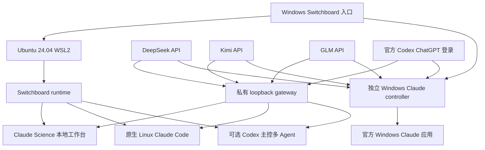

# Claude Codex Switchboard 3.3.0

**在 Windows 上用一个入口管理 Claude Science、Claude Code、官方 Windows Claude 应用，以及可选的 Codex 主控多 Agent 工作区。**

[English](README.md) · [完整操作手册](operation.md) · [代码剖析](docs/CODE_WALKTHROUGH.zh-CN.md) · [相近项目检索与采纳报告](docs/PROJECT_RESEARCH_REPORT.zh-CN.md)

## 能解决什么

Claude Codex Switchboard 面向希望复用现有 API 或官方 Codex ChatGPT 登录、同时又不想把 Windows 和 WSL 认证混在一起的用户。它提供四条上游路线：

| 上游 | 认证所有者 | WSL Claude Science | WSL Claude Code | Windows Claude | 多 Agent Claude workers |
| --- | --- | --- | --- | --- | --- |
| DeepSeek API | 当前 WSL 用户的私有 key，或 Windows DPAPI profile | 支持 | 支持 | 支持 | 支持 |
| Kimi API | 当前 WSL 用户的私有 key，或 Windows DPAPI profile | 支持 | 支持 | 支持 | 支持 |
| GLM API | 当前 WSL 用户的私有 key，或 Windows DPAPI profile | 支持 | 支持 | 支持 | 支持 |
| ChatGPT / Codex | 对应系统内官方 Codex CLI 的 `auth.json` | 支持 | 支持 | 支持 | 支持 |

这里有两套互不调用的应用面：

- **WSL 面**：Claude Science 使用隔离的本地工作台身份，不需要 Claude.ai 账号登录；Claude Code、Codex CLI、provider key 与 Science 身份分别持有。
- **Windows 面**：官方 Windows Claude 应用使用独立 profile、独立 loopback gateway 和 Windows 认证，不读取、不修改、不启动 WSL。

两边都可以配置 Opus、Sonnet、Haiku 三档，每一档分别保存：

- `Model`：真实上游模型 ID；
- `Reasoning`：该模型支持的推理强度。

Sonnet 不再和 Opus 共用一个输入框或被默认锁成同一档。Codex profile 会读取官方 Codex CLI 的本地 model cache，在可用时列出最近声明的模型与 reasoning levels，并拒绝 cache 明确不支持的固定组合。该 cache 不是实时 entitlement 或请求一定被接受的保证。

## 运行结构



切换 provider 时，WSL runtime 会停止自己拥有的 Science/gateway，写入经过验证的新 route，启动同一身份下的新 gateway，再核对 PID、endpoint、health 与 Claude Science 会话。失败时恢复之前的受管文件和 route；不会关闭其他 WSL 发行版，也不会执行全局 `wsl --shutdown`。

## 快速安装

### 要求

- Windows 10 2004+ 或 Windows 11；
- WSL2；
- Ubuntu 24.04；首次 Build 可在得到系统权限后安装；
- 普通 Windows 用户，不要求长期使用管理员账户；
- 只有使用独立 Windows Claude gateway 时需要 **Windows Python 3.10+**；`Build.cmd` 安装的是 WSL Python，不会静默安装 Windows Python；
- 至少一项有效上游认证：DeepSeek/Kimi/GLM API key，或官方 Codex CLI 的 ChatGPT 登录。

### 下载与启动

```powershell
git clone https://github.com/Tsaer-maker/claude-codex-switchboard.git
Set-Location .\claude-codex-switchboard
.\Build.cmd
.\Switchboard.cmd
```

也可以在解压目录直接双击：

1. `Build.cmd`：首次安装或完整修复；
2. `Switchboard.cmd`：打开统一菜单。

Build 安装或核验：

- Ubuntu 24.04 WSL2 系统依赖；
- 官方 Claude Science；
- 原生 Linux Claude Code；
- 官方 Linux Codex CLI；
- 固定版本 Node.js 与可选 Chrome DevTools MCP；
- 固定 commit 的 `claude-science-codex-connector`；
- Switchboard runtime、离线契约测试与升级回滚逻辑。

Build 不会要求把 API key 写进命令行、`.cmd`、README 或 Git。API key 只从隐藏输入读取。

## 第一次配置

### WSL Claude Science / Claude Code

从菜单选择任一 provider，或使用：

```powershell
.\windows\Switchboard.ps1 -Action configure-deepseek
.\windows\Switchboard.ps1 -Action configure-kimi
.\windows\Switchboard.ps1 -Action configure-glm
.\windows\Switchboard.ps1 -Action configure-codex
```

Codex 登录默认调用 WSL 内官方 Codex CLI 的 browser/device 登录。它写入：

```text
~/.finalkit-client/.codex/auth.json
```

该文件不属于 Claude Science，也不等于 OpenAI API key。

### 可选：一次性把 Windows Codex 登录复制到 WSL

如果 Windows 官方 Codex CLI 已显示 `Logged in using ChatGPT`，可以执行：

```powershell
.\windows\08-One-Time-Migrate-Windows-Codex-Auth-to-WSL.cmd
```

或：

```powershell
.\windows\Switchboard.ps1 -Action migrate-windows-codex-auth-to-wsl
```

该操作只通过 stdin 把当前官方 Windows `auth.json` 作为一次性输入交给 WSL，并在 WSL 内由官方 Codex CLI 验证。完成后：

- Windows auth 仍由 Windows Codex CLI 持有；
- WSL 得到独立副本；
- 原先的 WSL 状态会精确恢复为 stopped、gateway-only，或原 provider 的 Science + gateway；
- 不建立自动同步；
- 以后 Windows 或 WSL 任一侧仍可自主重新登录；
- 不读取或改变 Claude Science 账号状态。

## 三档模型与 Reasoning

查看当前 route：

```powershell
.\windows\Switchboard.ps1 -Action models
```

交互修改：

```powershell
.\windows\Switchboard.ps1 -Action update-models
```

每个 provider 都会依次询问：

1. Opus Model；
2. Opus Reasoning；
3. Sonnet Model；
4. Sonnet Reasoning；
5. Haiku Model；
6. Haiku Reasoning。

当前允许的 reasoning 值：

| Provider | 可选 Reasoning |
| --- | --- |
| DeepSeek | `auto`、`none`、`high`、`max` |
| Kimi | K2.6：`auto`、`none`；K2.7-code：仅 `auto`；K3：`auto`、`low`、`high`、`max` |
| GLM | 4.7：`auto`、`none`；5.2：`auto`、`none`、`low`、`medium`、`high`、`xhigh`、`max`；5.3：`auto`、`low`、`high`、`max` |
| Codex | `auto`、`none`、`low`、`medium`、`high`、`xhigh`、`max`、`ultra`；固定值受本地 cache 声明约束 |

模型级规则分别依据 [Kimi Thinking Models](https://platform.kimi.ai/docs/guide/use-thinking-models) 与 [GLM Thinking Mode](https://docs.bigmodel.cn/cn/guide/capabilities/thinking)：K3 只发送 top-level `reasoning_effort`，K2.6 只使用 thinking 开关，K2.7-code 保持始终 thinking；GLM 5.2/5.3 与 4.7 使用各自真实能力。

3.3.0 使用稳定的跨 provider 语义子集：GLM 5.2 官方 `minimal` 不另设 UI 档，关闭 thinking 统一选择 `none`。

API provider 的 `auto` 只透传当前 provider + model 明确支持的角色级 effort，不支持组合明确失败。Codex 的 `auto` 在本地 cache 声明存在时按具体模型校验；声明缺失时标记为 capability unknown 并由上游最终判定，不冒充已验证。固定值会覆盖该 Claude 档位中的上游角色 effort。`models_cache.json` 不是实时 entitlement；实时接受情况只能由显式 tier test 的实际请求确认。

命令行原子更新示例：

```powershell
.\windows\Switchboard.ps1 `
  -Action update-models `
  -RemainingArgs codex,--opus,gpt-5.6-sol,--reasoning-opus,max,--sonnet,gpt-5.6-terra,--reasoning-sonnet,max,--haiku,gpt-5.6-luna,--reasoning-haiku,max,--restart
```

## 启动入口

### WSL Claude Science

```powershell
.\windows\10-Start-DeepSeek.cmd
.\windows\11-Start-ChatGPT-Codex.cmd
.\windows\12-Start-Kimi.cmd
.\windows\13-Start-GLM.cmd
```

或：

```powershell
.\windows\Switchboard.ps1 -Action deepseek
.\windows\Switchboard.ps1 -Action codex
```

浏览器打开的 Science 使用 Switchboard 隔离 data-dir。它显示 Claude 兼容模型别名，但实际 model/reasoning route 可由 `models`、`status` 和 `EFFECTIVE_ROUTE` 查看。

### 原生 WSL Claude Code

```powershell
.\windows\Switchboard.ps1 -Action claude -RemainingArgs deepseek
.\windows\Switchboard.ps1 -Action claude -RemainingArgs codex
```

Claude Code 复用选定 provider gateway，不复制 Science 身份。

### 独立 Windows Claude

Switchboard 配置的是用户已经安装的官方 Windows Claude 应用及其独立 profile；应用本体的提供、可用地区、版本和账号方案仍由 Anthropic 决定，本项目不分发或破解该应用。

先建立四条 Windows-only profile：

```powershell
.\windows\40-Initialize-Windows-Claude.cmd
```

再分别配置：

```powershell
.\windows\41-Configure-Windows-Claude-DeepSeek.cmd
.\windows\42-Configure-Windows-Claude-Kimi.cmd
.\windows\43-Configure-Windows-Claude-GLM.cmd
.\windows\44-Configure-Windows-Claude-Codex-Login.cmd
```

Windows profile 显示名保持简短：

- `DeepSeek API`
- `Kimi API`
- `GLM API`
- `Codex Login`

API key 由当前 Windows 用户的 DPAPI 加密。Codex profile 只绑定官方 Windows Codex CLI ChatGPT 登录，不询问 OpenAI API key。Windows controller 的代码路径不含 `wsl.exe` 调用，端口和运行状态也与 WSL 分开。

## 可选多 Agent 模块

3.3.0 新增 WSL-only 多 Agent 模块。它把 Codex 保持为用户意图、路由与最终核验者，再通过 provider-routed Claude Code PTY workers 承担适合分离的检索、实现、调试或审阅工作。

安装和检查：

```powershell
.\windows\60-Multi-Agent.cmd
.\windows\61-Multi-Agent-Status.cmd
```

命令形式：

```powershell
.\windows\Switchboard.ps1 -Action agents-install
.\windows\Switchboard.ps1 -Action agents-status
.\windows\Switchboard.ps1 -Action agents -Project D:\work\repo -RemainingArgs deepseek
.\windows\Switchboard.ps1 -Action agents -Project D:\work\repo -RemainingArgs codex
.\windows\Switchboard.ps1 -Action agents-on
.\windows\Switchboard.ps1 -Action agents-off
.\windows\Switchboard.ps1 -Action agents-stop
```

当前集成固定为 [coredo-eu/codex-claude-orchestrator](https://github.com/coredo-eu/codex-claude-orchestrator) `0.3.1`、commit `c996b497c6682f4695b5aa342610527731712c51`。Switchboard 不 fork 或删除其角色与生命周期实现，而是在外层增加：

- 精确 commit、origin、clean-tree 与许可证检查；
- 隔离的 WSL Codex HOME；
- DeepSeek、Kimi、GLM、Codex 四条 Claude worker route；
- provider/auth 环境白名单；
- 安装前依赖与 Claude CLI flag 检查；
- read-only status；
- enable、disable、只停止已验证 owned workers 的 kill switch；
- Windows 菜单和指定项目目录启动。

上游保留的主要能力包括 persistent PTY parent、Haiku/Sonnet/Opus/Fable 角色路由、租约与 edit custody、私有 runtime snapshot、compaction checkpoint、并发上限、失败后显式 custody transfer、Codex native fallback roles 与最终独立核验。

Reasoning 有一个可见的控制边界：同一 Claude 档位内，上游不同 role 可以请求不同 effort。该档配置为 `auto` 时，API provider 按具体模型校验；Codex 在 cache 能力已知时同样前置校验，未知时明确显示 unknown。若用户显式选择固定值，该值会有意覆盖该档所有上游 role effort。

安装该模块不会：

- 修改 Windows Claude；
- 修改 Claude Science 身份；
- 复制 provider key 到插件目录；
- 把 Windows auth 变成自动同步；
- 批量安装检索到的其他 orchestrator。

这里提供的是 **environment/auth 隔离，不是 filesystem sandbox**。Worker 继承 Codex/Claude 的 tool approval，并以同一个 WSL 用户运行；它可以访问用户选定的项目，也可以访问该 WSL 用户本来就能看到的 `/mnt/<drive>` 等挂载。不要把无关 secret 放在工作区；需要限制文件或命令访问时，应使用 Codex/Claude 自身的 approval/sandbox。文档中的“未注入 Windows auth”只表示 controller 不复制 Windows credential，不表示 Windows 文件在技术上不可达。

启动入口先强制要求 `MULTI_AGENT_READY=true`；checkout、plugin、enable 状态、依赖或 WSL Codex 登录任一缺失时都会阻断，不会把普通 Codex 会话冒充成多 Agent。若 Claude Science 正在运行，worker provider 必须与其健康 active gateway 一致；不同 provider 需要用户先显式切换或停止 Science，Agent 入口本身不会偷偷改 Science route。

安装完成后必须新建一个 **Codex task**，让新 skill 被发现；随后在任务中显式调用：

```text
Use $codex-claude-orchestrator:claude-pty-agents for this bounded outcome.
Keep Codex as the authority owner and independently verify Claude's handoff.
```

安装 plugin 只开放 transport，普通提示词不保证自动委派。Switchboard 不会自动改项目 `AGENTS.md`，也不会偷偷写入 executor-selection policy；若用户以后希望项目长期优先委派，应人工审阅上游 policy snippet 后与项目规则合并。

其他相近项目的机制、许可证、采纳项和未采纳原因见[检索与采纳报告](docs/PROJECT_RESEARCH_REPORT.zh-CN.md)。

## 更新与诊断

```powershell
# 只更新包内 runtime，保留 WSL、认证和 model routes
.\windows\05-Update-Switchboard-Runtime.cmd

# 重新配置模型和 reasoning
.\windows\06-Update-Provider-Models.cmd

# 明确联网更新官方工具
.\windows\07-Update-Official-Tools.cmd

# 状态和 doctor
.\windows\20-Status.cmd
.\windows\21-Doctor.cmd
```

Runtime 更新只对 package-managed code、connector owner、wrapper 和版本 metadata 做精确失败回滚；auth、model routes 及其最新派生 config 明确不属于 installer rollback，因而不会用旧快照覆盖官方 Codex CLI 或另一个终端刚提交的状态。它不会因品牌改名迁移 credential 目录。官方工具更新与 runtime 更新分开，避免一次更新同时改变代码、认证与模型路由。

## 认证与安全边界

| 对象 | 持有位置 | 是否跨 Windows/WSL 自动同步 |
| --- | --- | --- |
| WSL DeepSeek/Kimi/GLM key | 当前 WSL 用户私有文件，权限 600 | 否 |
| Windows DeepSeek/Kimi/GLM key | 当前 Windows 用户 DPAPI blob | 否 |
| WSL Codex 登录 | `~/.finalkit-client/.codex/auth.json` | 否；可一次性导入 |
| Windows Codex 登录 | 官方 Windows Codex CLI `%CODEX_HOME%\auth.json` | 否 |
| WSL Claude Science 身份 | `~/.science-finalkit` 本地隔离身份 | 不属于 provider auth |
| Windows Claude profile | `%LOCALAPPDATA%\ScienceCodexFinalKit\WindowsClaude` | 不读取 WSL |
| 多 Agent 状态 | 隔离 WSL Codex HOME 与 pinned integration | 不注入 Windows auth；不是文件系统沙箱 |

网络边界：

- gateway 只绑定 `127.0.0.1`；
- 私有 path/control token 由安装时随机生成；
- PID、可执行文件、命令行、root、endpoint 与 health 共同验证 owner；
- 未识别的 Science credential、connector 修改或端口 owner 会阻断接管；
- 不改 `.wslconfig`、Docker、系统代理或其他发行版；
- 不绕过账号登录、验证码、订阅、配额、地区、组织或付费限制。

## 为什么保留旧内部目录名

产品显示名和入口已改为 Claude Codex Switchboard，但以下内部名字暂时保留：

- `%LOCALAPPDATA%\ScienceCodexFinalKit`
- `~/.local/share/science-codex-finalkit`
- `~/.science-finalkit`
- `~/.finalkit-client`
- `FINALKIT_*`
- `fkctl`

它们已经参与 credential 路径、DPAPI entropy、connector control header、进程 owner 与升级识别。仅为改名迁移它们会增加认证丢失和旧安装失效风险。文档把它们定义为 **legacy-compatible internal namespace**；它们不是第二套产品，也不会继续扩散到新的用户可见名称。

## 文档与验证

- [operation.md](operation.md)：安装、模型、auth、Windows/WSL、多 Agent、更新、诊断与恢复；
- [docs/CODE_WALKTHROUGH.zh-CN.md](docs/CODE_WALKTHROUGH.zh-CN.md)：代码 owner、调用链、安全边界和契约；
- [docs/PROJECT_RESEARCH_REPORT.zh-CN.md](docs/PROJECT_RESEARCH_REPORT.zh-CN.md)：相近项目检索快照、许可证、借鉴机制、实际采纳与拒绝原因；
- [THIRD_PARTY_NOTICES.md](THIRD_PARTY_NOTICES.md)：运行时第三方组件与许可证通知。

Switchboard 原创代码与文档采用 [MIT License](LICENSE)；第三方组件继续服从各自许可证。面向其他用户的安装不依赖作者本机路径、用户名或现有 auth，所有 credential 都在安装用户自己的 Windows/WSL owner 中建立。
