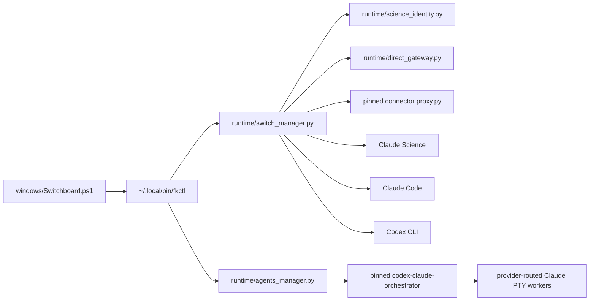

# Claude Codex Switchboard 3.3.0 代码剖析

本文说明当前代码 owner、认证边界、model/reasoning 映射、Windows/WSL 隔离、多 Agent 集成与验证入口。它不重复操作手册。

## 1. 顶层入口

| 文件 | 责任 |
| --- | --- |
| `Build.cmd` | 调用 Windows controller 的 `build` action |
| `Switchboard.cmd` | 打开统一菜单 |
| `Clear.cmd` | 经备份和精确确认删除目标 WSL 发行版 |
| `windows/Switchboard.ps1` | Windows 总入口、WSL 安装、命令路由、浏览器桥、Windows Claude 与多 Agent 菜单 |
| `windows/WindowsClaude.ps1` | 完全 Windows-only 的 Claude profile/controller |
| `wsl/install-final-stack.sh` | Ubuntu 系统依赖、官方工具、固定 connector、runtime 部署与回滚 |
| `wsl/fkctl` | 已安装 WSL runtime 的稳定 CLI 入口 |

产品名已经统一为 **Claude Codex Switchboard**。`fkctl`、`FINALKIT_*` 与旧状态目录仍作为 legacy-compatible internal namespace，避免移动 credential、改变 DPAPI entropy 或破坏旧进程 owner。

## 2. WSL owner 图



### 2.1 `switch_manager.py`

它是 WSL 主 runtime owner，负责：

- 持久 model routes；
- provider secret 路径；
- gateway 配置和进程记录；
- Science 本地身份调用；
- transactional switch/restart；
- Claude Science 一次性 nonce admission；
- WSL Codex browser/device login；
- Windows auth JSON 的 stdin import；
- 原生 Claude Code 与 provider-routed Codex 启动；
- status、doctor、smoke 和 tier test。

它不直接实现 Windows Claude，也不保存 Windows DPAPI secret。

### 2.2 `direct_gateway.py`

DeepSeek、Kimi、GLM 共享同一个 direct gateway owner。固定上游 host/path、认证 header、loopback bind 和 provider allowlist。Claude 兼容 model alias 通过：

```text
requested alias -> opus | sonnet | haiku -> model_<role> + reasoning_<role>
```

其中 `claude-fable-*` 显式归入 Opus tier，不再静默落到 Sonnet。

Reasoning 转换由 provider 独立控制：

- `auto` 解析 `thinking` / `output_config.effort` / `reasoning_effort`，只保留 provider + model 支持的值；
- `none` 禁用 thinking；
- 其他值写入 provider 支持的 thinking / effort 字段；
- disabled 优先并清除冲突 effort；不支持值 fail closed，不静默降档；
- Kimi K3、K2.6、K2.7-code 与 GLM 4.7、5.2、5.3 分别按模型能力生成 wire；
- 无关 request 字段保持不变。

### 2.3 固定 Codex connector

`install-final-stack.sh` 固定：

```text
repository https://github.com/haoyuan-sjtu/claude-science-codex-connector.git
commit     30b26d7c6f097b186bbd228e93a427a731399960
```

安装器只在 origin、commit 和受管 `proxy.py` hash 符合时应用 `wsl/connector-security.patch`。未知本地改动 fail closed。

Connector 只负责 ChatGPT/Codex Responses ↔ Claude-compatible 协议转换。DeepSeek、Kimi、GLM 不经过它。

## 3. Claude Science 本地身份

`science_identity.py` 只管理 `~/.science-finalkit`：

- 固定本地 user/org UUID；
- 空 refresh token；
- 随机长期本地 access token；
- AES-GCM v2 credential shape；
- 可识别旧本地身份的一次迁移；
- 未知或真实 credential 原样保留并阻断覆盖。

Science 启动进程只接收 loopback `ANTHROPIC_BASE_URL`、session-only `ANTHROPIC_AUTH_TOKEN` 与空 `ANTHROPIC_API_KEY` sentinel。Provider key 和 Codex auth 不进入 Science identity。

Admission 链为：

```text
start Science
  -> obtain one-time loopback URL
  -> accept exactly one nonce
  -> POST /api/auth/nonce in memory cookie jar
  -> require /api/me = 200 and expected local user/org
  -> require Claude Science page title
  -> return a separate unconsumed URL to the browser
```

Switchboard 不劫持 `claude.ai`，也不把本地身份描述成远端 Claude 账号。

## 4. Model / Reasoning schema

WSL 持久配置：

```text
~/.local/share/science-codex-finalkit/config/model-routes.json
schema_version = 3
```

每个 route 都有六个独立字段：

```json
{
  "model_opus": "...",
  "reasoning_opus": "...",
  "model_sonnet": "...",
  "reasoning_sonnet": "...",
  "model_haiku": "...",
  "reasoning_haiku": "..."
}
```

迁移逻辑接受早期共享字段；旧 schema 曾允许、但新模型级规则已判定不兼容的 Kimi/GLM effort 会原子迁移为 `auto`，模型和其他角色保持不变。Windows profile 同步升级到 schema 4。

WSL Codex catalog owner 是隔离 auth 旁的 `models_cache.json`。解析字段：

- `slug`；
- `display_name`；
- `supported_reasoning_levels`；
- `default_reasoning_level`。

Windows `WindowsClaude.ps1` 使用相同的三档语义。Codex 配置界面显示本地 cache 最近广告的模型和 reasoning 描述；API provider 使用各自显式 allowlist。cache 是配置证据而非实时 entitlement。Sonnet prompt、seed、验证和写入都与 Opus 分离。

Codex `auto` 是路由语义。connector 与 Windows gateway 在 cache 声明存在时按选中模型校验 incoming effort；声明缺失时 capability 明确为 unknown，再由上游判定。显式固定值继续覆盖请求 effort。

## 5. WSL 认证边界

| Credential | Owner |
| --- | --- |
| DeepSeek/Kimi/GLM key | 当前 WSL 用户私有 secret 文件，600 |
| Codex ChatGPT login | `~/.finalkit-client/.codex/auth.json`，由官方 Codex CLI 验证 |
| Science workbench identity | `~/.science-finalkit` |
| Gateway path/control token | Switchboard runtime secret |
| 多 Agent plugin state | 隔离 `~/.finalkit-client/.codex` |

`private_child_environment` 采用白名单构造子进程环境，移除继承的 provider/auth/config 变量和 Windows `/mnt/c` PATH 段。实际 route token 只在目标 Claude/Science 子进程中设置。

Windows auth import 有以下 gate：

1. 输入只来自 stdin；
2. 大小不超过 1 MiB；
3. 必须是 UTF-8 JSON object；
4. 必须识别为官方 ChatGPT Codex auth；
5. token chain 完整；
6. staging owner 权限正确；
7. 官方 WSL Codex `login status` 通过；
8. WSL manager 在同一 `FileLock` 事务内取得无 secret 的 runtime 快照；
9. 在该 lock 内停止、原子 commit，失败则恢复旧 auth；
10. 在同一事务中精确恢复迁移前的 stopped、gateway-only 或原 provider Science + gateway 形态，并核对恢复后的 state。

## 6. Transactional runtime

Switch 使用单一 lock，依次验证旧状态、停止自己拥有的 Science、停止匹配 gateway、启动目标 gateway、启动 Science、验证 endpoint/session，再写 committed mode。

Owner 验证不是只看 PID：

- PID 存活；
- 可执行文件；
- 命令行；
- runtime root；
- instance ID；
- provider；
- private endpoint；
- health owner/control token。

端口被陌生进程占用、record 与进程不一致或 Science 官方控制面不可用时，不进行全局 kill。

Runtime update 的受管集合包含：

- `direct_gateway.py`；
- `agents_manager.py`；
- `science_identity.py`；
- `switch_manager.py`；
- connector `proxy.py`；
- connector/version metadata；
- `fkctl` 与 browser wrapper。

更新前保留这些 package owner 的精确存在状态、字节和 mode；失败删除本次新增 owner 并恢复旧代码。`bridge/config.json`、model routes 和两份 Codex auth 不在 installer rollback 集合中：route/config mutation 由 `FileLock` 下的 runtime owner 处理，官方 CLI auth 不会被旧 installer 快照覆盖。Package maintenance 另有互斥锁，避免 runtime 和 tools updater 互相回滚。

## 7. 独立 Windows Claude owner

`windows/WindowsClaude.ps1` 和 `windows/runtime/windows_claude_gateway.py` 组成 Windows-only stack。

`WindowsClaude.ps1` 负责：

- 四条固定 profile ID；
- profile schema 迁移；
- model/reasoning 交互和 catalog 校验；
- API key DPAPI 加密；
- Windows Codex auth owner discovery；
- gateway config、start/status/stop；
- Claude profile 注册与官方模式恢复；
- 备份和原子写。

`windows_claude_gateway.py` 负责：

- loopback bind；
- DPAPI secret 解密后的进程内使用；
- Anthropic Messages proxy；
- ChatGPT Codex Responses translation；
- model/reasoning route；
- control-token health；
- 官方 Codex `auth.json` 只读消费：官方 CLI 是唯一写入/刷新 owner；401 后仅在 CLI 已发布新 access token 时重试。

Windows controller 的静态契约要求其函数边界不出现 `wsl.exe`、`fkctl`、WSL state path 或 WSL auth import。Windows 端口默认为 18987，WSL gateway 默认为 9876。

显示 profile 名已缩短为 `DeepSeek API`、`Kimi API`、`GLM API`、`Codex Login`。迁移器只把精确旧显示名改短；用户自定义名字保持不变。

## 8. 可选多 Agent owner

`wsl/runtime/agents_manager.py` 是唯一 Switchboard integration owner。固定：

```text
repository https://github.com/coredo-eu/codex-claude-orchestrator.git
version    0.3.1
commit     c996b497c6682f4695b5aa342610527731712c51
license    MIT
```

安装路径：

```text
~/.local/share/science-codex-finalkit/integrations/codex-claude-orchestrator
```

Codex marketplace/plugin state 位于隔离 `~/.finalkit-client/.codex`。安装器核对 dependency、origin、commit、clean tree、LICENSE、toggle owner 与上游 self-check，再使用真实 Codex plugin JSON surface 注册 local marketplace。

`run_codex_with_provider` 先选择并验证 gateway，再构造隔离 Codex 环境：

```text
Codex leader auth = official WSL Codex login
Claude worker auth = selected loopback gateway
Windows auth = not injected
Science identity = not mutated
Filesystem sandbox = none; inherit tool approvals and WSL-user-visible mounts
```

插件本身继续拥有 PTY parent、roles、leases、snapshots、compaction、busy limit、fallback 和 kill switch；Switchboard 不复制或重写这些实现。Provider tier 的 `Reasoning=auto` 透传受支持的上游 role effort；固定值会覆盖该 tier 内的 role-specific effort。这一覆盖状态在启动前打印，而不是静默折叠。

`agents status` 即使尚未 ready 也返回一个成功的检查命令，并用 `MULTI_AGENT_READY=false` 表示状态，避免 Windows 菜单把“未安装”显示为 controller crash。

`fkctl codex` 在进入 `switch_manager.py` 前执行 `agents status --require-ready`。因此 plugin 未安装、source/version 不匹配、被禁用、依赖缺失或 WSL Codex 未登录时，启动 fail closed。`select_gateway` 还保证 live Science 不会被非 Science client 偷偷换 route：Agent route 与 active Science 不一致时直接拒绝。

Ready 只证明 transport 可用，不代表任意普通 prompt 都会委派。安装后需要新 Codex task 发现 skill，并显式调用 `$codex-claude-orchestrator:claude-pty-agents`。Windows 与 WSL 启动路径都会打印该提示；Switchboard 不自动写项目 `AGENTS.md` 或上游 policy snippet。

## 9. 浏览器桥

`windows/Switchboard.ps1` 只启动带独立 `--user-data-dir` 的 Chrome，并要求：

- remote debugging 绑定 loopback；
- 固定非默认端口；
- command line 含匹配 profile 和 port；
- endpoint 可读；
- stop 时只选择匹配 profile owner。

`wsl/chrome-devtools-mcp-finalkit` 是兼容命名的固定 Node wrapper；它连接隔离 Chrome，不自动注册到 Science 或 Claude Code。

## 10. 安装与第三方边界

`install-final-stack.sh` 固定 connector commit、Node version 和 Chrome MCP version。官方 Claude Science、Claude Code、Codex CLI 由各自官方 installer 下载；包不再分发其 binary。

可选 multi-agent checkout 只在 `agents-install` 时联网下载。其他调研项目不被批量安装，也没有代码复制。完整来源、commit、许可证与采纳理由见 [PROJECT_RESEARCH_REPORT.zh-CN.md](PROJECT_RESEARCH_REPORT.zh-CN.md) 和 [../THIRD_PARTY_NOTICES.md](../THIRD_PARTY_NOTICES.md)。

## 11. 契约测试

| 测试 | 覆盖 |
| --- | --- |
| `connector_contract.py` | 固定 connector model catalog、三档 route、reasoning、control 与 official-auth read-only |
| `direct_gateway_contract.py` | 三家 provider request、三档模型/强度、Fable→Opus |
| `agents_manager_contract.py` | pin、selector、环境去敏、隔离 HOME、status 语义 |
| `runtime_control_contract.py` | owner、switch、rollback、auth import、独立 Linux login、private env |
| `science_identity_contract.py` | 本地身份建立、迁移、未知 credential 保护 |
| `model_routes_contract.py` | schema 迁移、三档独立配置、catalog redirect gate、signal rollback |
| `windows_entry_contract.py` | Windows action、Science/Claude/multi-agent 路由、删除旧 handoff/skill 入口 |
| `windows_claude_controller_contract.ps1` | Windows profile、DPAPI、模型/强度、Python prerequisite、旧显示名迁移 |
| `windows_claude_gateway_contract.py` | Windows gateway、Codex official-auth external adoption、route 与 health |
| `installer_update_contract.sh` | package code 字节/mode rollback、并发 auth/route 保留、connector exact hash |

此外使用 PowerShell AST parser、`bash -n`、Python compile、`git diff --check` 和 README link/path readback。关键多 Agent Codex marketplace 命令在临时隔离 HOME 中进行真实 smoke，不读取现有 auth。

## 12. 已移除的非 owner 文件

3.3.0 不再包含未被 runtime 调用的 Claude Science review skill、便携 ZIP、项目 `HANDOFF.md` 模板和 Windows review prompt。产品主线是可运行 route、独立 auth、模型/强度配置和可选多 Agent plugin；不保留一套没有实际 owner 的平行交接协议。
